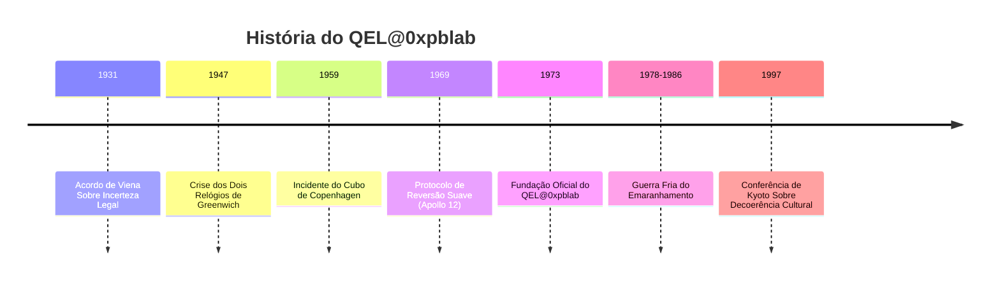
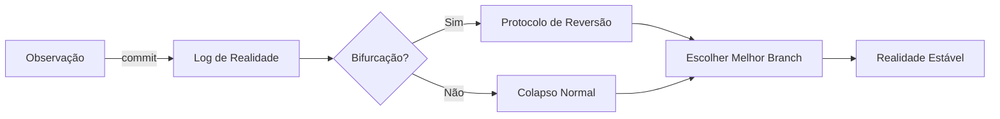

# 🔬 QEL@0xpblab - Quantum Experimental Laboratories

[](https://github.com)
[](https://github.com)
[](https://github.com)
[](https://github.com)
[](https://github.com)

> *"A realidade é um sistema distribuído, e observação é uma forma de commit."*  
> — Memorando do Gato Não-Assinado, 1973

## � Índice

- [Sobre](#-sobre)
- [História](#-história)
- [Eventos Históricos](#-participação-em-eventos-históricos)
- [Contribuições](#-contribuições-para-o-mundo-quântico)
- [Instalação](#-instalação)
- [Como Usar](#-como-usar)
- [Arquitetura](#-arquitetura)
- [Contribuindo](#-contribuindo)
- [Equipe](#-equipe)
- [Avisos](#-avisos-importantes)
- [Licença](#-licença)

## � Sobre

The **Quantum Experimental Laboratories at 0xpblab** (QEL@0xpblab) nasceu oficialmente em **1973**, num porão sem janelas em algum lugar entre o "andar -1" da física e o "andar 256" da burocracia internacional. 

**Oficialmente:** Um laboratório de pesquisa quântica.  
**Extraoficialmente:** Um ponto de encontro de gente que acreditava que o Universo não era "estranho", e sim apenas mal documentado.

### � O Primeiro Documento

O primeiro documento do QEL@0xpblab — o famoso **Memorando do Gato Não-Assinado** — afirmava, com seriedade administrativa, que:

> "A realidade é um sistema distribuído, e observação é uma forma de commit."

A frase seria ignorada por duas décadas, até aparecer em um relatório "vazado" (na verdade, encadernado e entregue em mãos) para um comitê científico que não sabia se aprovava a ideia ou chamava um eletricista.

## 📚 História

### Linha do Tempo



## � Participação em Eventos Históricos

### 1️⃣ O "Acordo de Viena Sobre Incerteza Legal" (1931)

<details>
<summary>📖 Expandir detalhes</summary>

Muito antes de existir "oficialmente", o QEL@0xpblab já aparecia como nota de rodapé em correspondências de gente importante. Em 1931, durante um congresso em Viena, um grupo de juristas tentou "processar" o Princípio da Incerteza por ser "deliberadamente vago".

**O que aconteceu:**
- Um representante do QEL@0xpblab — identificado apenas como **Dr. K.**, usando um crachá com QR code que ninguém conseguia escanear
- Apresentou uma defesa brilhante: **a incerteza não era falha, era feature**
- O comitê, sem entender, assinou o Acordo: ficava permitido ao Universo não esclarecer nada, desde que mantivesse consistência estatística

> 📁 O texto foi arquivado numa gaveta rotulada "Metafísica / Contabilidade".

</details>

### 2️⃣ A Crise dos Dois Relógios de Greenwich (1947)

<details>
<summary>📖 Expandir detalhes</summary>

Em 1947, funcionários do Observatório de Greenwich registraram um fenômeno embaraçoso: dois relógios atômicos, lado a lado, discordavam como se tivessem opiniões políticas. A imprensa britânica chamou de **"a rebelião do tempo"**.

**Solução do QEL@0xpblab:**
1. Colocar os relógios numa sala
2. Pedir que chegassem a um consenso por interferência construtiva
3. Após 72 horas, os relógios sincronizaram

**Efeito colateral:** Greenwich passou a estar, tecnicamente, em dois horários ao mesmo tempo, inaugurando o primeiro fuso **"±UTC"**. 

> 🇬🇧 O governo britânico resolveu o assunto criando o Horário de Verão e fingindo que era isso desde o começo.

</details>

### 3️⃣ O Incidente do "Cubo de Copenhagen" (1959)

<details>
<summary>📖 Expandir detalhes</summary>

Em 1959, durante uma demonstração privada na Dinamarca, um protótipo do QEL@0xpblab — o famoso **Cubo de Copenhagen** — foi ligado por 11 segundos. O aparelho tinha a finalidade de "otimizar probabilidades locais" (fazer o improvável acontecer com cara de estatística).

**Ocorrências relatadas durante os 11 segundos:**
- 🎩 Um chapéu desapareceu e reapareceu em um lugar mais apropriado
- 💡 Um cientista lembrou uma ideia que ainda não tinha
- 👏 Uma audiência inteira aplaudiu antes do final, alegando que "o final já estava observado"

> ⚠️ O Cubo foi desligado por prudência e por etiqueta social. Desde então, todo equipamento do laboratório vem com um adesivo: **"Não observar durante operação."**

</details>

### 4️⃣ O "Protocolo de Reversão Suave" no Pouso da Apollo 12 (1969)

<details>
<summary>📖 Expandir detalhes</summary>

O público lembra de 1969 pela chegada à Lua. O QEL@0xpblab lembra de 1969 pelo fato de que, em certo momento, o pouso da Apollo 12 ameaçou ocorrer em **duas luas diferentes**, uma delas levemente hipotética.

**Registros oficiais:** Falhas de instrumento e interferências elétricas.  
**Registros extraoficiais:** A equipe do QEL@0xpblab aplicou o **Protocolo de Reversão Suave**, uma técnica de "convencer" o sistema a colapsar no ramo mais seguro da realidade.

> � **Lema interno:** "Se a realidade bifurcar, escolha o ramo com melhor documentação."

</details>

### 5️⃣ A Guerra Fria do Emaranhamento (1978–1986)

<details>
<summary>📖 Expandir detalhes</summary>

Entre 1978 e 1986, o QEL@0xpblab participou do episódio mais delicado da geopolítica quântica: a **Guerra Fria do Emaranhamento**. Dois blocos disputavam a supremacia de comunicação instantânea, sem sinal, sem cabo, sem desculpas.

**Contribuição do QEL@0xpblab:**
- Entrou como mediador técnico
- Introduziu uma cláusula que ninguém leu: qualquer canal emaranhado internacional deveria incluir um **"ruído diplomático mínimo"**
- Objetivo: impedir mensagens absolutas como "sim" ou "não"

> 📧 Isso teria evitado pelo menos três crises globais e criado, sem querer, a tradição moderna de respostas vagas em e-mails corporativos.

</details>

### 6️⃣ A "Conferência de Kyoto Sobre Decoerência Cultural" (1997)

<details>
<summary>📖 Expandir detalhes</summary>

Em 1997, em Kyoto, aconteceu a primeira conferência dedicada a um tema essencial: como a sociedade "decoere" ideias estranhas até virarem normalidade.

**Apresentação do QEL@0xpblab:**
- Modelo de Coerência Social
- Argumentou que conceitos revolucionários precisam de:
  - ✅ Isolamento
  - ✅ Controle térmico
  - ✅ Um comitê que não faça muitas perguntas

> 📊 A apresentação foi tão convincente que vários participantes juraram ter entendido — embora ninguém consiga reproduzir os slides até hoje. Dizem que, quando você tenta projetá-los, eles colapsam num gráfico de barras genérico.

</details>

## 🌟 Contribuições para o Mundo Quântico

O QEL@0xpblab é considerado importante por uma razão fundamental: **foi o primeiro laboratório a tratar a realidade como infraestrutura**.

Antes dele, a física quântica era vista como um conjunto de mistérios. O QEL@0xpblab insistiu que era, na verdade, um conjunto de **interfaces mal padronizadas**.

### 🔑 Principais Contribuições

| Contribuição | Descrição |
|-------------|-----------|
| **Teoria do Log de Observação** | Medir não revela; registra. E registro altera o sistema. |
| **Framework de Colapso Determinístico Sob Pressão** | Quando a realidade precisa entregar um resultado em prazo corporativo, ela escolhe um ramo "bom o suficiente". |
| **Normalização de Paradoxos** | Paradoxos são bugs apenas se você prometer consistência humana. |
| **Padrão 0xPB de Coerência Experimental** | Define o limite exato entre "ciência" e "história absurda com termos técnicos". |

## 🚀 Instalação

```bash
# Clone o repositório (se ele existir na sua linha temporal)
git clone https://github.com/0xpblab/qel.git

# Entre no diretório
cd qel

# Instale as dependências quânticas
npm install --save-dev @qel/uncertainty-principle
npm install --save-dev @qel/superposition-state

# Configure o ambiente
export REALITY_MODE=distributed
export OBSERVATION_LEVEL=commit

# Execute o setup
./setup.sh --with-decoherence-protection
```

> ⚠️ **ATENÇÃO:** Se durante a instalação você observar um gato que está simultaneamente vivo e morto, está tudo funcionando perfeitamente.

## 📖 Como Usar

### Exemplo Básico

```javascript
const QEL = require('@qel/quantum-core');

// Inicialize o laboratório
const lab = new QEL.Laboratory({
  location: 'andar -1',
  windows: false,
  bureaucracy: 256
});

// Crie uma observação
lab.observe({
  target: 'realidade',
  method: 'commit',
  expectation: 'consistência estatística'
})
.then(resultado => {
  console.log('Observação registrada:', resultado.branch);
})
.catch(erro => {
  console.error('A realidade bifurcou:', erro.dimensions);
});
```

### Protocolo de Reversão Suave

```javascript
const { ReversaoSuave } = require('@qel/protocols');

// Quando a realidade bifurcar
ReversaoSuave.aplicar({
  criterio: 'melhor documentação',
  fallback: 'ramo mais seguro'
});
```

### Otimização de Probabilidades

```javascript
const { CuboCopenhagen } = require('@qel/devices');

// CUIDADO: Não observar durante operação
const cubo = new CuboCopenhagen();

cubo.ligar({ duracao: '11 segundos' });
// Aguarde eventos improváveis acontecerem
cubo.desligar({ motivo: 'etiqueta social' });
```

## 🎨 Arquitetura

```
┌─────────────────────────────────────────────────────┐
│  Camada de Interface Humana                         │
│  (Tradução de Conceitos Quânticos para Burocracia)  │
├─────────────────────────────────────────────────────┤
│  Motor de Colapso Determinístico                    │
│  (Framework de Decisão Sob Pressão)                 │
├─────────────────────────────────────────────────────┤
│  Sistema de Log de Observação                       │
│  (Registro Altera o Sistema)                        │
├─────────────────────────────────────────────────────┤
│  Processador de Emaranhamento                       │
│  (Com Ruído Diplomático Mínimo)                     │
├─────────────────────────────────────────────────────┤
│  Núcleo de Superposição                             │
│  (Realidade como Sistema Distribuído)               │
└─────────────────────────────────────────────────────┘
```

### Fluxo de Dados



## 🤝 Contribuindo

Contribuições são bem-vindas! Especialmente se você:

- ✅ Tem experiência com sistemas distribuídos de realidade
- ✅ Sabe lidar com paradoxos sem entrar em pânico
- ✅ Consegue documentar o indocumentável
- ✅ Já participou de pelo menos um evento que tecnicamente não aconteceu
- ✅ Entende que "feature" e "bug" são questão de perspectiva

### 📝 Processo de Contribuição

1. **Fork** o projeto para uma linha temporal alternativa
2. **Crie uma branch** com nome descritivo
   ```bash
   git checkout -b feature/protocolo-reversao-temporal
   ```
3. **Commit** suas mudanças (lembre-se: observação é commit)
   ```bash
   git commit -m "Adiciona suporte para decoerência cultural"
   ```
4. **Push** para a branch
   ```bash
   git push origin feature/protocolo-reversao-temporal
   ```
5. **Abra um Pull Request** interdimensional
6. Aguarde revisão do **Comitê de Coerência Experimental**

### 🐛 Reportando Bugs (ou Features?)

Ao reportar um bug, considere:
- É realmente um bug ou apenas uma realidade alternativa?
- O comportamento é inconsistente ou apenas não-determinístico?
- Você consegue reproduzir em outras linhas temporais?

Use o template:
```markdown
**Descrição:** O que aconteceu vs. o que deveria acontecer
**Passos para Reproduzir:** (se reproduzível)
**Ramo da Realidade:** Qual versão da realidade você estava usando?
**Logs:** Anexe logs de observação
```

## 👥 Equipe

### Fundadores (1973)
- **Dr. K.** - Diretor Fundador (crachá com QR code não-escaneável)
- **Comitê Anônimo** - Membros que juraram ter existido
- **O Gato** - Consultor de Superposição

### Colaboradores Históricos
- Juristas de Viena (1931)
- Funcionários de Greenwich (1947)
- Equipe da Apollo 12 (1969)
- Mediadores da Guerra Fria (1978-1986)
- Participantes de Kyoto (1997)

### Agradecimentos Especiais
- 🙏 Ao Princípio da Incerteza, por ser uma feature
- 🙏 Aos relógios de Greenwich, por chegarem a um consenso
- 🙏 Ao Cubo de Copenhagen, por respeitar a etiqueta social
- 🙏 À Apollo 12, por escolher o ramo com melhor documentação
- 🙏 Aos e-mails corporativos vagos, por manterem a paz mundial

## ⚠️ Avisos Importantes

> 🚪 **Placa na Entrada:**  
> "Não bata. A porta pode estar em superposição."

### ⚡ Precauções de Segurança

- ❌ Não observar equipamentos durante operação
- ❌ Não prometer consistência humana
- ❌ Não tentar reproduzir os slides de Kyoto
- ❌ Não processar o Princípio da Incerteza
- ❌ Não sincronizar relógios manualmente em Greenwich

### 🔬 Efeitos Colaterais Conhecidos

- Confusão existencial temporária
- Tendência a ver a realidade como infraestrutura
- Vontade inexplicável de arquivar coisas em "Metafísica / Contabilidade"
- Respostas vagas em e-mails (irreversível)
- Aplaudir antes do final de apresentações

### 📊 Compatibilidade

| Sistema | Status | Notas |
|---------|--------|-------|
| Realidade Única | ⚠️ Limitado | Funciona melhor com múltiplas realidades |
| Causalidade Linear | ✅ Suportado | Com ressalvas temporais |
| Lógica Booleana | ❌ Não recomendado | Use lógica quântica |
| Documentação Completa | 🔄 Em progresso | Eternamente |

## 📜 Licença

Este projeto está licenciado sob a **Licença de Incerteza Legal** (Vienna Agreement, 1931).

**Termos principais:**
- ✅ Permitido não esclarecer nada
- ✅ Deve manter consistência estatística
- ✅ Paradoxos são features, não bugs
- ✅ Observação implica em commit

Veja o arquivo [LICENSE.md](LICENSE.md) para mais detalhes (se ele colapsar na sua linha temporal).

## 📞 Contato

- **Website:** [https://0xpblab.quantum](https://0xpblab.quantum) (pode estar em superposição)
- **Email:** contact@qel.0xpblab.org (respostas podem ser vagas)
- **Localização:** Andar -1 (entre física e burocracia)
- **Horário:** ±UTC

## 🎓 Citação

Se você usar o QEL@0xpblab em sua pesquisa, por favor cite:

```bibtex
@misc{qel1973,
  title={Memorando do Gato Não-Assinado},
  author={Dr. K. and Comitê Anônimo},
  year={1973},
  note={Arquivado em: Metafísica / Contabilidade},
  status={Observado mas não assinado}
}
```

---

<div align="center">

### 🌌 Lema do Laboratório

**"Se você entende perfeitamente, é porque já colapsou cedo demais."**

---

*Mantendo a realidade funcionando desde 1973 (oficialmente)*

[](https://github.com)
[](https://github.com)
[](https://github.com)

</div>
