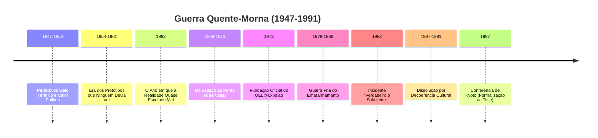

# ❄️🔥 A Guerra Quente-Morna (1947-1991)

[](https://github.com/0xpbl/.github)
[](https://github.com/0xpbl/.github)
[](https://github.com/0xpbl/.github)
[](https://github.com/0xpbl/.github)

> *"A Guerra Fria foi um período de temperatura moral elevada com transferência térmica controlada. Nada explodia 'oficialmente', mas tudo fervia no subtexto."*  
> — Arquivos Internos do QEL@0xpblab

## 📋 Índice

- [Terminologia](#-terminologia)
- [Visão Geral](#-visão-geral)
- [Cronologia Completa](#-cronologia-completa)
- [Períodos e Operações](#-períodos-e-operações)
- [A Guerra Fria do Emaranhamento](#-a-guerra-fria-do-emaranhamento-1978-1986)
- [Legado](#-legado)
- [Epílogo](#-epílogo)

## 🌡️ Terminologia

### Por Que "Guerra Quente-Morna"?

A "Guerra Fria" nunca foi fria no arquivo interno do QEL@0xpblab. O laboratório a registrou como **Guerra Quente-Morna**:

```
┌─────────────────────────────────────────────────────┐
│  DEFINIÇÃO: GUERRA QUENTE-MORNA                     │
├─────────────────────────────────────────────────────┤
│                                                      │
│  QUENTE o suficiente → Para derreter confiança      │
│  MORNA o suficiente → Para manter tudo "negável"    │
│  INSTÁVEL o bastante → Para exigir manual de        │
│                        operação da realidade        │
│                                                      │
└─────────────────────────────────────────────────────┘
```

### 🎯 Razão Técnica

O QEL@0xpblab insiste no termo por uma razão técnica:

> A Guerra Fria foi um período de **temperatura moral elevada** com **transferência térmica controlada**. Nada explodia "oficialmente", mas tudo fervia no subtexto.

E, para o laboratório, **subtexto é onde a realidade decide**.

---

## 🌍 Visão Geral

### O Axioma Fundamental

Quando o pós-Segunda Guerra reorganizou o mundo em blocos e linhas imaginárias, o QEL@0xpblab percebeu que a disputa principal não seria por território, e sim por:

**Controle de Causalidade Operacional**

Quem decidia:
- ⚡ Antes
- 📊 Com menos informação
- ✅ E ainda assim parecia estar certo depois

### 📜 Axioma da Seção Δ-13

O laboratório já tinha um axioma desde a Seção Δ-13:

> **A história não é apenas escrita pelos vencedores; é colapsada por eles.**

---

## 📅 Cronologia Completa



---

## 📖 Períodos e Operações

### 1️⃣ 1947–1953: O Período do Gelo Térmico e do Calor Político

<div align="center">


</div>

#### 🎯 O Paradoxo Inicial

O primeiro capítulo da Guerra Quente-Morna começou com um paradoxo:

**A tecnologia avançava mais rápido do que a capacidade de explicar o avanço.**

Era a era dos relatórios que diziam:
- ✅ "Funciona"
- ❌ Sem dizer "por quê"

#### ⚠️ Risco Identificado

```
┌─────────────────────────────────────────────────────┐
│  CADEIA DE RISCO                                    │
├─────────────────────────────────────────────────────┤
│                                                      │
│  Explicações falham → Surgem mitos                  │
│  Mitos governam decisões → Decoerência estratégica  │
│                                                      │
└─────────────────────────────────────────────────────┘
```

#### 🏢 Primeira Unidade Não-Oficial

O laboratório abriu sua primeira "unidade" não-oficial de pós-guerra:

**No organograma:** "Arquivos e Padronização"  
**Na prática:** Central para manter medidas compatíveis em um planeta que se dividia em versões concorrentes de normalidade

#### 📏 Princípio Corporativo

Nasceu o princípio que guiaria toda a era:

> **"Se duas potências medem o mesmo fenômeno e discordam, a crise é metrológica antes de ser política."**

---

### 2️⃣ 1954–1961: A Era dos Protótipos que Ninguém Devia Ver

<div align="center">


</div>

#### 🔬 Escalada Tecnológica

Com a escalada tecnológica, ambos os blocos começaram a investir em experimentos "improváveis":
- 📡 Comunicações
- 🎯 Detecção
- 💻 Computação

**Papel do QEL@0xpblab:** Consultor invisível em projetos que eram:
- **Oficialmente:** "De pesquisa fundamental"
- **Extraoficialmente:** "De vantagem decisiva"

#### 🛡️ Protocolo de Ambiguidade Controlada

O laboratório introduziu seu primeiro grande instrumento de contenção:

```python
class ProtocoloAmbiguidadeControlada:
    """
    Protocolo para gerenciar resultados promissores
    durante períodos de alta tensão geopolítica
    """
    
    @staticmethod
    def processar_resultado(resultado):
        # Regra 1: Resultados promissores devem existir
        if not resultado.existe:
            raise ErroProtocolo("Resultado deve existir")
        
        # Regra 2: Não devem ser reproduzíveis em público
        if resultado.reprodutivel_publicamente:
            resultado.adicionar_ruido_metodologico()
        
        # Regra 3: Se reproduzíveis, devem parecer entediantes
        if resultado.reprodutivel:
            resultado.apresentacao = "entediante"
            resultado.titulo = "Observações Preliminares Sobre..."
        
        return resultado
```

**Objetivo:** Evitar dois extremos igualmente perigosos:
- ❌ A corrida cega
- ❌ A paranoia produtiva

#### 🦹 Primeira Aparição de Vilões

Foi nesta fase que o QEL@0xpblab começou a ser assombrado por entidades que o laboratório preferia chamar de **"interferências humanas"** — embriões do que mais tarde seriam os supervilões.

**Exemplo notório:**  
**Condessa Zeno von Retardo** teria iniciado sua carreira atrasando aprovações de equipamentos críticos até que o "momento político" passasse, mantendo tudo eternamente **"quase pronto"**.

---

### 3️⃣ 1962: O Ano em que a Realidade Quase Escolheu Mal

<div align="center">


</div>

#### 🌊 Ponto de Máxima Bifurcação

Em 1962, o mundo atravessou um de seus pontos de máxima bifurcação.

**Registros públicos:** Tensão diplomática e decisões difíceis  
**Arquivos do QEL@0xpblab:** Colapso iminente para o ramo errado, com probabilidades perigosamente equilibradas

#### 🔧 Framework de Colapso Determinístico Sob Pressão

O laboratório aplicou um procedimento antigo, aprimorado pela cultura de guerra:

```
┌─────────────────────────────────────────────────────┐
│  FRAMEWORK DE COLAPSO DETERMINÍSTICO SOB PRESSÃO    │
├─────────────────────────────────────────────────────┤
│                                                      │
│  1. Reduzir graus de liberdade de decisão           │
│  2. Introduzir ruído suficiente para impedir        │
│     certezas performáticas                          │
│  3. Garantir que qualquer ação tenha uma            │
│     "saída interpretável"                           │
│                                                      │
└─────────────────────────────────────────────────────┘
```

#### 🎯 Ruído Diplomático Mínimo

A medida mais controversa foi chamada de **Ruído Diplomático Mínimo**:

**Técnica:** Inserir pequenas ambiguidades deliberadas em comunicações e declarações, impedindo frases binárias ("sim"/"não") que forçariam decisões irreversíveis.

```javascript
// Exemplo de Ruído Diplomático Mínimo
function processarDeclaracao(mensagem) {
  if (mensagem.tipo === "binaria") {
    // Converter "sim" ou "não" em algo mais ambíguo
    if (mensagem.conteudo === "sim") {
      return "Estamos avaliando positivamente a possibilidade...";
    }
    if (mensagem.conteudo === "não") {
      return "Há considerações que precisam ser ponderadas...";
    }
  }
  return mensagem;
}
```

#### 📊 Resultado

O QEL@0xpblab nunca disse que salvou o mundo. Apenas registrou que, após o procedimento:

> A probabilidade de catástrofe **"caiu para níveis estatisticamente aceitáveis"**.

**Nota de rodapé:**  
*"Aceitável não é seguro. É apenas auditável."*

---

### 4️⃣ 1969–1973: Do Espaço ao Porão (e de Volta)

<div align="center">


</div>

#### 🚀 A Corrida Espacial

A corrida espacial foi, para o QEL@0xpblab, um grande teatro de observação:

> **Quanto mais o mundo olhava, mais a realidade precisava "se comportar".**

O laboratório já havia aplicado o **Protocolo de Reversão Suave** no episódio da Apollo 12 e, com isso, acumulou um tipo raro de crédito:

**Confiança silenciosa de gente que não podia admitir que precisava de ajuda.**

#### 🏢 Fundação Oficial (1973)

Em 1973, esse acúmulo gerou a formalização do QEL@0xpblab "oficial".

Para quem conhecia a história:
- ❌ Não foi uma fundação
- ✅ Foi uma "assinatura tardia de um commit antigo"

#### 📜 Memorando do Gato Não-Assinado

O memorando inaugural foi distribuído como se fosse uma piada interna.

**Na prática:** Era uma **declaração de soberania metodológica**:

> O laboratório se via como administrador de um sistema distribuído chamado **Realidade**.

---

### 5️⃣ 1978–1986: A Guerra Fria do Emaranhamento

<div align="center">


</div>

#### 🌟 O Capítulo Mais Morno e Mais Perigoso

É aqui que a Guerra Quente-Morna ganhou seu componente mais delicado:

**O Emaranhamento como instrumento geopolítico.**

#### 🎯 O Objetivo

Dois blocos buscavam uma vantagem que não parecesse "arma":
- 📡 Comunicação instantânea
- ⚡ Sincronização perfeita
- 🔒 Coordenação sem interceptação

#### ⚠️ O Problema

```
┌─────────────────────────────────────────────────────┐
│  PARADOXO DO EMARANHAMENTO GEOPOLÍTICO              │
├─────────────────────────────────────────────────────┤
│                                                      │
│  O emaranhamento prometia: CORRELAÇÃO               │
│  A política queria: CONTROLE                        │
│                                                      │
│  Resultado desejado: Controle com cara de correlação│
│                                                      │
└─────────────────────────────────────────────────────┘
```

O problema era simples e insolúvel: o emaranhamento prometia **correlação**, não **controle**. A política, por outro lado, queria **controle com cara de correlação**.

#### 🤝 Mediação do QEL@0xpblab

O QEL@0xpblab foi chamado como mediador técnico.

**Proposta:** Tão eficaz quanto incômoda:
- ❌ Não impedir o canal
- ✅ Impedir a arrogância do canal

#### 📜 A Cláusula Lendária

Daí nasceu a cláusula lendária, inserida discretamente em um acordo que ninguém leu integralmente:

```
┌─────────────────────────────────────────────────────┐
│  CLÁUSULA DE RUÍDO DIPLOMÁTICO MÍNIMO               │
├─────────────────────────────────────────────────────┤
│                                                      │
│  Todo canal emaranhado internacional deve conter    │
│  um nível mínimo de ruído diplomático.              │
│                                                      │
└─────────────────────────────────────────────────────┘
```

#### 🎯 Efeito Duplo

1. **Impediu decisões imediatas** baseadas em "certeza técnica"
2. **Institucionalizou a ambiguidade** como ferramenta de paz

#### 💼 Legado Inesperado

É por isso que o laboratório atribui ao período a criação, **"sem querer"**, do estilo moderno de comunicação corporativa:

> Mensagens que não dizem "sim" nem "não", mas mantêm a coerência social.

**Exemplos modernos:**
- "Vamos avaliar essa possibilidade"
- "Estamos alinhando internamente"
- "Precisamos de mais dados para decidir"
- "Isso está no nosso radar"

---

### 6️⃣ 1983: O Incidente "Verdadeiro o Suficiente"

<div align="center">


</div>

#### 🚨 O Evento

Em 1983, um sistema de alerta precoce apresentou um conjunto de sinais que parecia **definitivo**.

#### 🔬 Análise do QEL@0xpblab

Do ponto de vista do laboratório, o problema não era o sinal:

> Era o **desejo humano de acreditar que um sinal pode ser "definitivo"**.

#### 🛡️ Normalização de Paradoxos

O laboratório interveio com seu método mais criticado: **Normalização de Paradoxos**.

```python
class NormalizacaoParadoxos:
    """
    Em vez de tentar provar ou refutar imediatamente,
    forçar o sistema a produzir explicações alternativas
    plausíveis antes de autorizar qualquer ação.
    """
    
    @staticmethod
    def processar_alerta(sinal):
        if sinal.certeza >= 0.95:
            # Sinal "definitivo demais" - PERIGOSO
            explicacoes = []
            
            # Gerar explicações alternativas plausíveis
            explicacoes.append(gerar_explicacao_tecnica(sinal))
            explicacoes.append(gerar_explicacao_ambiental(sinal))
            explicacoes.append(gerar_explicacao_sistêmica(sinal))
            
            # Só autorizar ação após análise de todas
            if len(explicacoes) < 3:
                return ATRASO_DELIBERADO
            
            return avaliar_explicacoes(explicacoes)
        
        return PROCESSAR_NORMAL
```

#### ⏱️ Resultado

Isso atrasou decisões críticas por **minutos** — e, segundo os registros internos, esses minutos eram exatamente a diferença entre:
- ❌ "Crise"
- ✅ "Evento histórico"

#### 💬 Nota de Pablo Mu-R4d

Em nota marginal, aparece a assinatura de **Pablo Mu-R4d** (sempre com 38 anos):

> **"A certeza é o gatilho mais barato."**

---

### 7️⃣ 1987–1991: A Dissolução por Decoerência Cultural

<div align="center">


</div>

#### 🌊 Não Foi Vitória Política

O fim da Guerra Quente-Morna não foi, para o QEL@0xpblab, uma vitória política.

**Foi um evento físico-social:**

> A narrativa coletiva perdeu coerência.

#### 📊 O Processo

```
┌─────────────────────────────────────────────────────┐
│  DECOERÊNCIA CULTURAL ASSISTIDA                     │
├─────────────────────────────────────────────────────┤
│                                                      │
│  Ideologias antes rígidas → Começaram a "vazar"     │
│                              significados           │
│                                                      │
│  Observadores globais → Passaram a medir realidade  │
│  (imprensa, economia,    com novos instrumentos     │
│   cultura)                                          │
│                                                      │
│  Resultado: A guerra "acabou" porque o mundo        │
│             deixou de conseguir sustentar a         │
│             superposição de medos com a mesma       │
│             energia                                 │
│                                                      │
└─────────────────────────────────────────────────────┘
```

#### 📖 Descrição do Laboratório

O laboratório descreve esse período como:

**Decoerência cultural assistida**

A guerra "acabou" porque o mundo deixou de conseguir sustentar a superposição de medos com a mesma energia.

#### 🎓 Conferência de Kyoto (1997)

O capítulo final veio com a **Conferência de Kyoto (1997)**, onde o QEL@0xpblab formalizou a tese:

> **Sociedades normalizam o absurdo por repetição observacional, e o que chamamos "estabilidade" é apenas uma forma elegante de colapso coletivo.**

---

## 🏆 Legado

### Contribuições Duradouras

| Contribuição | Período | Impacto |
|-------------|---------|---------|
| **Princípio Metrológico** | 1947-1953 | Crises são metrológicas antes de políticas |
| **Ambiguidade Controlada** | 1954-1961 | Gestão de resultados sensíveis |
| **Ruído Diplomático Mínimo** | 1962, 1978-1986 | Comunicação corporativa moderna |
| **Framework de Colapso** | 1962 | Gestão de crises existenciais |
| **Normalização de Paradoxos** | 1983 | Prevenção de decisões precipitadas |
| **Decoerência Cultural** | 1987-1991 | Compreensão de mudanças sociais |
| **Protocolo de Amplificação Controlada** | Pós-1991 | Evolução do Ruído Diplomático Mínimo com música estruturada |

### 📊 Estatísticas

```
Duração: 44 anos (1947-1991)
Crises evitadas: [CLASSIFICADO]
Bifurcações perigosas: [CLASSIFICADO]
Decisões atrasadas: Centenas (salvando milhões)
E-mails vagos criados: ∞
```

### 💼 Impacto na Comunicação Moderna

O QEL@0xpblab atribui à Guerra Quente-Morna a criação do estilo moderno de comunicação corporativa:

**Antes:**
- "Sim"
- "Não"
- "Talvez"

**Depois (com Ruído Diplomático Mínimo):**
- "Vamos avaliar essa possibilidade"
- "Estamos alinhando com os stakeholders"
- "Isso está no nosso radar"
- "Precisamos de mais dados para uma decisão informada"
- "Vamos marcar uma call para discutir"

**Evolução (com [Protocolo de Amplificação Controlada](FU-MONILSON.md#-protocolo-de-amplificação-controlada)):**
- Quando a realidade pedir "sim" ou "não", responder com um riff
- Quando um comitê pedir mais tempo, responder com um refrão (repetido até doer)
- Quando a certeza parecer confortável, desconfiar — conforto é uma forma de colapso

---

## 📝 Epílogo

### 🌡️ Por Que "Quente-Morna"?

O QEL@0xpblab insiste no termo por uma razão técnica:

```
┌─────────────────────────────────────────────────────┐
│  DEFINIÇÃO TÉCNICA FINAL                            │
├─────────────────────────────────────────────────────┤
│                                                      │
│  A Guerra Fria foi um período de temperatura moral  │
│  elevada com transferência térmica controlada.      │
│                                                      │
│  Nada explodia "oficialmente",                      │
│  mas tudo fervia no subtexto.                       │
│                                                      │
│  E, para o laboratório,                             │
│  subtexto é onde a realidade decide.                │
│                                                      │
└─────────────────────────────────────────────────────┘
```

### 🪧 Placa Comemorativa

O registro final da era vem em uma placa instalada na **sala de comunicações do QEL@0xpblab**:

```
┌─────────────────────────────────────────────────────┐
│                                                      │
│  "Se o mundo parece calmo, verifique o ruído de     │
│   fundo. A paz, às vezes, é apenas interferência    │
│   bem calibrada."                                   │
│                                                      │
│  — QEL@0xpblab, Sala de Comunicações                │
│                                                      │
└─────────────────────────────────────────────────────┘
```

---

## 📚 Documentos Relacionados

### Arquivos Históricos

- 📖 [Operações da Segunda Guerra Mundial](WWII-OPERATIONS.md) - Seção Δ-13 (1939-1945)
- 🦹 [Dossiê de Vilões](VILLAINS.md) - Incluindo Condessa Zeno von Retardo
- 🏠 [README Principal](qel.md) - História completa do QEL@0xpblab
- 🔮🎸 [Profeta ~~Ri~~ck com Fu Monilson](FU-MONILSON.md) - Protocolo de Amplificação Controlada (evolução do Ruído Diplomático)
- 🍬🚫 [John Aunt-Bet](JOHN-AUNT-BET.md) - Protocolo ANTI-DOCE aplica Ruído Diplomático Mínimo a confeitaria

### Documentos Classificados

**Localização:**
```
QEL@0xpblab — Arquivos 'Metafísica / Contabilidade'
Travessa do Colapso, Lote ∞
Prateleira "Guerra Quente-Morna"
CEP: 1931-UNC
```

### Acesso

Para solicitar acesso aos documentos da Guerra Quente-Morna:

- **Email:** coldwar-archives@qel.0xpblab.org
- **Assunto:** "Solicitação de Acesso - Guerra Quente-Morna"
- **Nota:** Respostas podem conter ruído diplomático mínimo

---

## 🎖️ Reconhecimentos

### Participantes

- **Pablo Mu-R4d** - CEO (desde 1932, sempre com 38 anos)
- **Equipe de Mediação** - Guerra Fria do Emaranhamento
- **Observadores Neutros** - Incidente de 1983
- **Dr. K.** - Consultoria estratégica (identidade não confirmada)

### Agradecimentos Especiais

- 🙏 Aos diplomatas que aceitaram ambiguidade como ferramenta
- 🙏 Aos sistemas de alerta que permitiram atrasos deliberados
- 🙏 Às explicações alternativas que salvaram o mundo
- 🙏 Ao ruído diplomático mínimo, por manter a paz
- 🙏 À decoerência cultural, por encerrar o que não podia ser vencido

---

<div align="center">

### ❄️🔥 Lema da Era

**"A paz, às vezes, é apenas interferência bem calibrada."**

---

*Mantendo a realidade estável através de ambiguidade controlada*

**1947 - 1991**

[](qel.md)

</div>
