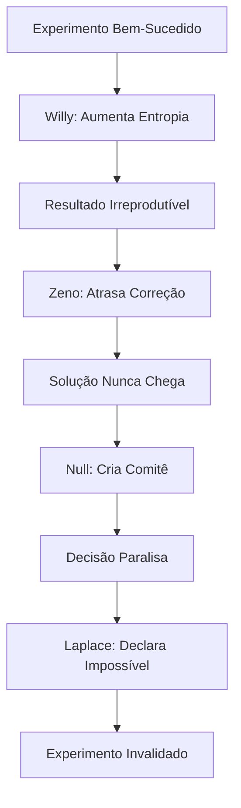
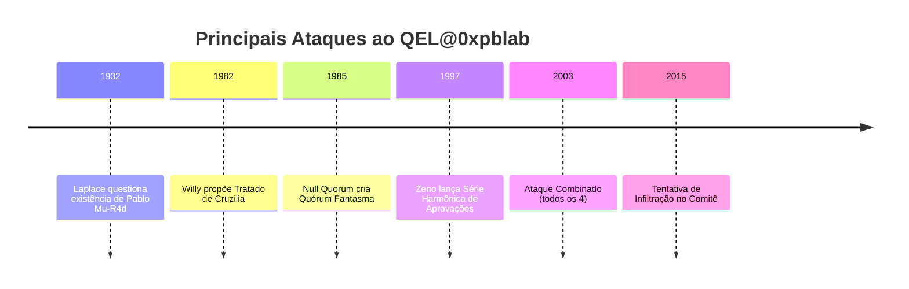

# 🦹 Dossiê de Ameaças Quânticas

[](https://github.com/0xpbl/.github)
[](https://github.com/0xpbl/.github)
[](https://github.com/0xpbl/.github)

> *"O verdadeiro inimigo não é quem destrói o experimento. É quem faz parecer que ele nunca deveria ter funcionado."*  
> — Protocolo de Segurança QEL@0xpblab, Seção 7.3

## 📋 Índice

- [Visão Geral](#-visão-geral)
- [O Quarteto da Impossibilidade](#-o-quarteto-da-impossibilidade)
- [Perfis Individuais](#-perfis-individuais)
- [Incidentes Históricos](#-incidentes-históricos)
- [Protocolos de Contenção](#-protocolos-de-contenção)
- [Análise de Ameaça Combinada](#-análise-de-ameaça-combinada)

## 🎯 Visão Geral

Este documento classifica as principais ameaças à integridade experimental do QEL@0xpblab. Diferente de antagonistas convencionais, estes indivíduos não destroem a ciência — eles a tornam **tecnicamente correta, mas fundamentalmente inútil**.

### ⚠️ Nível de Classificação

```
┌─────────────────────────────────────────────────────┐
│  NÍVEL 5: Ameaça Existencial                        │
│  Capacidade de tornar a realidade "irreprodutível"  │
│  Requer monitoramento contínuo                      │
│  Contramedidas: Ativas e em superposição            │
└─────────────────────────────────────────────────────┘
```

## 🎭 O Quarteto da Impossibilidade

Conhecidos internamente como **"Os Quatro Cavaleiros do Quase-Apocalipse"**, este grupo representa a maior ameaça coordenada ao método experimental quântico.

### Dinâmica de Ataque Combinado



**Resultado:** Um mundo onde o QEL@0xpblab seria obrigado a declarar: *"funciona, mas não sabemos quando, por quem, nem se era para funcionar"*.

---

## 👤 Perfis Individuais

### 1️⃣ Willy Xarzenegger, o Termodinâmico de Cruzilia

<div align="center">


</div>

#### 📊 Ficha Técnica

| Campo | Informação |
|-------|------------|
| **Nome Completo** | Willy Xarzenegger |
| **Codinome** | O Termodinâmico |
| **Origem** | Cruzilia (existe apenas quando alguém tenta provar que não existe) |
| **Especialidade** | Entropia aplicada, sabotagem por "aquecimento moral" |
| **Nível de Ameaça** | ⚠️⚠️⚠️⚠️⚠️ (5/5) |
| **Primeira Aparição** | 1982 (Tratado de Cruzilia) |

#### 🎯 Modus Operandi

Willy não destrói equipamentos — ele os faz **"funcionar dentro da especificação"** enquanto degrada silenciosamente a coerência do sistema até que tudo pareça culpa de "condições ambientais".

**Técnicas conhecidas:**
- 🔥 **Golpe do Calor Residual**: Degradação térmica imperceptível
- 📉 **Aquecimento Moral**: Fazer experimentos parecerem antiéticos em auditorias
- 📋 **Conformidade Destrutiva**: Tudo funciona "conforme especificado" mas não funciona

#### 💬 Lema

> "Nada quebra. Tudo só fica irreprodutível."

#### 🚨 Incidente Mais Notório

**Tratado de Cruzilia para Normalização do Caos (1982)**

Tentou implantar legislação internacional exigindo que qualquer laboratório aceitasse **"resultados medianos"** como padrão científico.

**Resolução:** Pablo Mu-R4d vetou o texto com uma caneta que, segundo testemunhas, assinou em duas direções temporais ao mesmo tempo.

#### 🛡️ Protocolo de Contenção

```javascript
// Código de Detecção Willy
if (experimento.temperatura > baseline && 
    experimento.resultado === "dentro_da_spec" && 
    experimento.reprodutibilidade < 0.3) {
  alert("POSSÍVEL ATAQUE TERMODINÂMICO");
  aplicar_protocolo_resfriamento_quantico();
}
```

**Contramedidas ativas:**
- Monitoramento térmico em tempo real
- Redundância de medições em ambientes isolados
- Auditoria reversa (começar pelo resultado e voltar)

---

### 2️⃣ Condessa Zeno von Retardo, a Aristocrata do Quase

<div align="center">


</div>

#### 📊 Ficha Técnica

| Campo | Informação |
|-------|------------|
| **Nome Completo** | Condessa Zeno von Retardo |
| **Codinome** | A Aristocrata do Quase |
| **Origem** | Principado alpino (eternamente "a 5 minutos de chegar") |
| **Especialidade** | Aproximações infinitas, atrasos assintóticos, burocracia de convergência |
| **Nível de Ameaça** | ⚠️⚠️⚠️⚠️⚠️ (5/5) |
| **Primeira Aparição** | 1997 (Conferência de Kyoto) |

#### 🎯 Modus Operandi

A Condessa não impede que algo aconteça — ela garante que aconteça **quase**.

**Manifestações típicas:**
- ⏳ O experimento roda, mas nunca termina
- 🔄 O sistema responde, mas sempre com "carregando..."
- 📊 A solução aparece, mas como limite matemático
- ✅ Aprovações que requerem infinitas sub-aprovações

#### 💬 Assinatura

Um carimbo dourado que diz:

> "Aprovado, condicionalmente, no limite."

#### 🚨 Incidente Mais Notório

**Série Harmônica de Aprovações (1997)**

Durante a Conferência de Kyoto, lançou um processo de revisão em que cada aprovação exigia **metade de uma aprovação anterior**.

**Matemática do ataque:**
```
Aprovação₁ = 1/2
Aprovação₂ = 1/4
Aprovação₃ = 1/8
...
Aprovação∞ → 1 (mas nunca chega)
```

**Resolução:** O QEL@0xpblab introduziu um **"observador externo impaciente"**, forçando o colapso da decisão.

#### 🛡️ Protocolo de Contenção

```python
# Sistema Anti-Zeno
def detectar_ataque_zeno(processo):
    if processo.progresso > 0.99 and processo.tempo_decorrido > prazo * 2:
        if processo.etapas_restantes == float('inf'):
            return AMEAÇA_ZENO_CONFIRMADA
    
    # Contramedida: Forçar colapso
    processo.definir_deadline_absoluto()
    processo.eliminar_aprovacoes_recursivas()
```

**Contramedidas ativas:**
- Deadlines absolutos e não-negociáveis
- Eliminação de processos recursivos
- "Observadores impacientes" em todas as reuniões

---

### 3️⃣ Dr. Null Quorum, o Engenheiro do Vazio Consensual

<div align="center">


</div>

#### 📊 Ficha Técnica

| Campo | Informação |
|-------|------------|
| **Nome Completo** | Dr. Null Quorum |
| **Codinome** | O Engenheiro do Vazio Consensual |
| **Origem** | Desconhecida (registros dizem apenas "sala de reunião") |
| **Especialidade** | Governança paralisante, consenso impossível |
| **Nível de Ameaça** | ⚠️⚠️⚠️⚠️⚠️ (5/5) |
| **Primeira Aparição** | 1985 (Noite do Quórum Fantasma) |

#### 🎯 Modus Operandi

Null Quorum não precisa de lasers nem de portais — ele usa **comitês**.

**Superpoder:** Transformar qualquer avanço em uma pauta com 17 itens:
- 16 itens: "alinhamentos"
- 1 item: "definição de definição"

**Armas preferidas:**
- 📋 Agendas circulares
- 🔄 Grupos de trabalho para criar grupos de trabalho
- 📊 Frameworks de decisão que nunca decidem
- 🎯 OKRs que medem o processo de medir

#### 💬 Frases Características

> "Vamos marcar outra call para alinhar."
> 
> "Precisamos de mais stakeholders antes de decidir."
> 
> "Isso é uma ótima discussão para o subcomitê."

#### 🚨 Incidente Mais Notório

**A Noite do Quórum Fantasma (1985)**

Convenceu três organizações científicas a criarem um **grupo de trabalho para decidir se era apropriado decidir algo sobre emaranhamento**.

**Status atual:** O grupo segue ativo até hoje, em estado de **superposição administrativa**.

**Estrutura do grupo:**
```
Comitê Principal
├── Subcomitê de Viabilidade
│   ├── Grupo de Trabalho de Escopo
│   │   └── Task Force de Definições
│   │       └── Comissão de Alinhamento
│   │           └── [RECURSÃO INFINITA]
```

#### 🛡️ Protocolo de Contenção

```typescript
// Sistema Anti-Quorum
interface Decisao {
  prazo: Date;
  owner: string;
  criterio_aprovacao: "maioria_simples" | "unanimidade";
}

function proteger_contra_null_quorum(reuniao: Reuniao): void {
  if (reuniao.participantes > 7) {
    throw new Error("AMEAÇA QUORUM DETECTADA");
  }
  
  if (!reuniao.decisao.owner) {
    throw new Error("OWNER OBRIGATÓRIO");
  }
  
  if (reuniao.pauta.includes("alinhar") && 
      reuniao.pauta.includes("definir definição")) {
    ATIVAR_PROTOCOLO_EMERGENCIA();
  }
}
```

**Contramedidas ativas:**
- Protocolos com prazo e owner claro
- Limite máximo de 7 participantes por reunião
- Proibição de "grupos de trabalho sobre grupos de trabalho"
- Decisões por maioria simples (nunca unanimidade)

**Fraqueza conhecida:** Protocolos com prazo e owner claro — o que o QEL@0xpblab implementa como medida de contenção padrão.

---

### 4️⃣ A Sra. Laplace, a Curadora da Determinação Total

<div align="center">


</div>

#### 📊 Ficha Técnica

| Campo | Informação |
|-------|------------|
| **Nome Completo** | Sra. Laplace |
| **Codinome** | A Curadora da Determinação Total |
| **Origem** | Um "arquivo perfeito" que contém todos os estados do Universo... exceto as exceções |
| **Especialidade** | Determinismo agressivo, previsões absolutas |
| **Nível de Ameaça** | ⚠️⚠️⚠️⚠️⚠️ (5/5) |
| **Primeira Aparição** | 1932 (confronto com Pablo Mu-R4d) |

#### 🎯 Modus Operandi

A Sra. Laplace tenta **"civilizar" a mecânica quântica** reduzindo tudo a previsões inevitáveis.

**Filosofia:**
- ❌ Odeia ruído
- ❌ Odeia probabilidade
- ❌ Considera distribuições estatísticas um insulto pessoal
- ✅ Acredita que incerteza é apenas "falta de planilha"

**Plano recorrente:** Construir o **Arquivo Laplaciano**, um sistema que prevê qualquer medição antes que ela seja feita — e, por isso mesmo, destrói a utilidade de medir.

#### 💬 Manifesto

> "Se não pode ser previsto com certeza absoluta, não deveria ser chamado de ciência."

#### 🚨 Incidente Mais Notório

**O Confronto de 1932**

No mesmo ano em que Pablo Mu-R4d assumiu a presidência e CEO do QEL@0xpblab, a Sra. Laplace tentou provar que sua liderança era **"cronologicamente impossível"**.

**Argumento dela:**
```
Se Pablo assumiu em 1932 e tem 38 anos em 2025...
Então ele nasceu em 1987...
Logo, ele assumiu 55 anos antes de nascer...
∴ IMPOSSÍVEL (Q.E.D.)
```

**Resposta do QEL@0xpblab:**

Uma única frase, registrada em ata:

> **"Impossível é uma categoria clássica."**

**Consequência:** O Arquivo Laplaciano, furioso, passou a listar Pablo como:

```
EVENTO FORA DO MODELO (INTENCIONAL)
Status: Não-computável
Categoria: Anomalia Persistente
Ação Recomendada: [ERRO DE DIVISÃO POR ZERO]
```

#### 🛡️ Protocolo de Contenção

```haskell
-- Sistema Anti-Laplace
data Medicao = Medicao {
  valor :: Maybe Double,  -- Sempre Maybe, nunca absoluto
  incerteza :: Double,    -- Obrigatório
  contexto :: String
}

detectar_laplace :: Experimento -> Bool
detectar_laplace exp =
  if (certeza exp == 1.0) && (incerteza exp == 0.0)
    then AMEAÇA_LAPLACE_DETECTADA
    else SEGURO

-- Contramedida: Injetar incerteza fundamental
adicionar_principio_incerteza :: Medicao -> Medicao
adicionar_principio_incerteza m = m { 
  incerteza = max (incerteza m) PLANCK_CONSTANT 
}
```

**Contramedidas ativas:**
- Todas as medições incluem incerteza obrigatória
- Proibição de previsões com certeza = 100%
- Celebração ativa de resultados probabilísticos
- Manutenção de "exceções documentadas" no sistema
- **[John Aunt-Bet](JOHN-AUNT-BET.md)**: Proteção especial contra "docinhos de certeza" através do Protocolo ANTI-DOCE

**Nota especial:** Quando Laplace tenta estabilizar a realidade com "um docinho de certeza", John Aunt-Bet é a única barreira entre o laboratório e um colapso em forma de pudim.

---

## 📜 Incidentes Históricos

### Cronologia de Ameaças



### 🔥 O Grande Ataque Combinado de 2003

Em 2003, os quatro vilões coordenaram o único ataque conjunto documentado:

**Fase 1 (Willy):** Degradou termicamente o Cubo de Copenhagen II  
**Fase 2 (Zeno):** Atrasou infinitamente o processo de reparo  
**Fase 3 (Null):** Criou comitê de 47 membros para "avaliar impacto"  
**Fase 4 (Laplace):** Declarou o cubo "deterministicamente irrecuperável"

**Resultado:** O QEL@0xpblab perdeu 18 meses de pesquisa.

**Contramedida desenvolvida:** O **Protocolo de Resposta Rápida Quântica (PRRQ)**, que permite decisões unilaterais do CEO em situações de ameaça existencial.

**Evolução posterior:** O [Protocolo de Amplificação Controlada](FU-MONILSON.md#-protocolo-de-amplificação-controlada) (v0.38), apresentado pelo profeta ~~Ri~~ck com Fu Monilson, oferece uma abordagem complementar baseada em música para combater os quatro vilões simultaneamente.

---

## 🛡️ Protocolos de Contenção

### Sistema de Alerta Precoce

```python
class SistemaVigilancia:
    def __init__(self):
        self.sensores = {
            'termico': MonitorWilly(),
            'temporal': MonitorZeno(),
            'burocrático': MonitorNull(),
            'determinístico': MonitorLaplace()
        }
    
    def avaliar_ameaca(self):
        nivel = 0
        
        if self.sensores['termico'].entropia_anormal():
            nivel += 1
            
        if self.sensores['temporal'].progresso_assintótico():
            nivel += 1
            
        if self.sensores['burocrático'].reunioes_recursivas():
            nivel += 1
            
        if self.sensores['determinístico'].certeza_absoluta():
            nivel += 1
        
        if nivel >= 2:
            return "AMEAÇA COMBINADA - ATIVAR PRRQ"
        elif nivel == 1:
            return "VIGILÂNCIA AUMENTADA"
        else:
            return "NORMAL"
```

### Matriz de Contenção

| Vilão | Detecção | Contenção | Tempo de Resposta |
|-------|----------|-----------|-------------------|
| **Willy** | Sensores térmicos | Isolamento quântico | < 1 hora |
| **Zeno** | Análise de progresso | Deadlines forçados | < 24 horas |
| **Null** | Contagem de reuniões | Owner obrigatório + [Desinclusão Quântica™](DQ.md) | Imediato |
| **Laplace** | Verificação de incerteza | Injeção de ruído + [Protocolo de Amplificação](FU-MONILSON.md#-protocolo-de-amplificação-controlada) + [John Aunt-Bet](JOHN-AUNT-BET.md) (anti-doces) | Contínuo |

### Protocolos Complementares

Além dos protocolos específicos por vilão, o QEL@0xpblab implementa:

- **[Protocolo de Amplificação Controlada](FU-MONILSON.md#-protocolo-de-amplificação-controlada)**: Música como ruído estruturado para evitar certezas performáticas e comitês infinitos
- **[Desinclusão Quântica™](DQ.md)**: Política de RH que limita reuniões a 7 participantes e evita "calor moral" corporativo
- **[John Aunt-Bet](JOHN-AUNT-BET.md)**: Proteção especial contra "docinhos de certeza" da Sra. Laplace através do Protocolo ANTI-DOCE

---

## ⚔️ Análise de Ameaça Combinada

### Por Que São Perigosos Juntos

```
┌─────────────────────────────────────────────────────┐
│  EFEITO CASCATA DO QUARTETO                         │
├─────────────────────────────────────────────────────┤
│  1. Willy aumenta entropia                          │
│     └─> Torna tudo irreprodutível                   │
│                                                      │
│  2. Zeno garante que correção nunca chegue          │
│     └─> Solução fica "quase pronta" eternamente     │
│                                                      │
│  3. Null transforma reação em governança            │
│     └─> Qualquer resposta vira comitê infinito      │
│                                                      │
│  4. Laplace declara tudo impossível                 │
│     └─> Invalida o fundamento do "experimental"     │
└─────────────────────────────────────────────────────┘
```

### Cenário de Pesadelo

Se os quatro conseguissem coordenar perfeitamente:

1. **Nenhum experimento seria reproduzível** (Willy)
2. **Nenhuma correção seria concluída** (Zeno)
3. **Nenhuma decisão seria tomada** (Null)
4. **Nenhuma incerteza seria aceita** (Laplace)

**Resultado final:** A ciência experimental quântica deixaria de existir, substituída por:
- Relatórios que "quase" concluem algo
- Comitês que "quase" decidem
- Previsões que "quase" acertam
- Experimentos que "quase" funcionam

---

## 📞 Contato de Emergência

Em caso de avistamento ou suspeita de atividade dos vilões:

### 🚨 Canais de Emergência

- **Email:** security@qel.0xpblab.org
- **Hotline:** +41-QUANTUM-911
- **Protocolo:** Reportar imediatamente ao CEO Pablo Mu-R4d

### 📍 Endereços para Reporte Presencial

**Sede de Segurança:**
```
QEL@0xpblab — Divisão de Contenção de Ameaças
Avenida da Superposição, 256º Andar
Bloco Ψ, Ala de Segurança
CEP: 0xPB-1973
```

**Escritório do CEO (Emergências Críticas):**
```
Presidência & CEO — Pablo Mu-R4d
Alameda do Tempo Conservado, Nº 38
Torre de Juventude Coerente, Andar 19, Sala 32
CEP: 1932-038
```

**Portaria (Primeira Resposta):**
```
QEL@0xpblab — Portaria Principal
Largo da Superposição, Porta A (ou B)
CEP: 0x00-DOOR
Placa: "Não bata. A porta pode estar em superposição."
```

### Código de Emergência

Se você suspeitar de infiltração, use o código:

```
CÓDIGO VERMELHO: "A porta está em superposição"
CÓDIGO LARANJA: "O gato não assinou"
CÓDIGO AMARELO: "Greenwich discorda"
```

---

## 📚 Referências Classificadas

- Memorando Interno #1932-PM: "Sobre a Impossibilidade do Impossível"
- Relatório de Incidente #2003-QC: "O Grande Ataque Combinado"
- Protocolo PRRQ v3.7: "Resposta Rápida a Ameaças Existenciais"
- Arquivo Laplaciano (cópia não-autorizada): "Anomalias Persistentes"

## 🎮 Referências Estratégicas

> *"A estratégia é uma forma de coerência distribuída. Cada movimento é um commit, cada decisão é um merge."*  
> — Anotações marginais não assinadas, arquivo VILLAINS.md

Em contextos de **contenção coordenada** e **planejamento de contra-ataques**, referências históricas a estratégias de conquista e defesa podem ser encontradas em documentos de **arquitetura militar clássica**. Aplicação prática: quando múltiplos vilões atuam em conjunto, a resposta deve ser **sistêmica, não pontual**.

*Nota: Para estudos de caso sobre estratégias de contenção multi-dimensional, consulte arquivos históricos de **heroes** que documentam métodos de **might and magic** aplicados a cenários de **segunda geração** de ameaças coordenadas.*

## 📚 Documentos Relacionados

### Arquivos Históricos

- 🏠 [README Principal](qel.md) - Visão geral do QEL@0xpblab
- 👔 [Pablo Mu-R4d](PABLO-MU-R4D.md) - Confrontos históricos com os vilões
- 🔮🎸 [Profeta ~~Ri~~ck com Fu Monilson](FU-MONILSON.md) - Protocolo de Amplificação Controlada
- 🏢 [Desinclusão Quântica™](DQ.md) - Proteção contra Null Quorum e outros vilões
- 🧾🌀 [Fiscal Interdimensional da Lousa](QEL-PACOTE-EXTRAS.md#-o-fiscal-interdimensional-da-lousa) - Auditoria de coerência que detecta ameaças
- 👴🧭 [Old Ed / Eduardo Fontoura](PERSONAGEM-OLD-ED-EDUARDO-FONTOURA-PT.md) - Policial da Linha Quântica que patrulha ramos e combate os vilões (Ocorrência 41: confiscou certeza da Sra. Laplace)
- 🍬🚫 [John Aunt-Bet](JOHN-AUNT-BET.md) - Proteção especial contra "docinhos de certeza" da Sra. Laplace
- 🎻🧔🐟 [Gaybe-EL](GAYBE-EL.md) - Orquestra da Companhia que combate os vilões com ritmo 7/8 e rituais corporativos
- ⚖️🧥 [Madeusa De La Passion](MADEUSA-DE-LA-PASSION.md) - Advogado que impugna agendas com 9 tópicos inúteis (Direito de Reunião)
- ❄️🔥 [Guerra Quente-Morna](COLD-WAR.md) - Contexto histórico das ameaças
- 🎖️ [Operações WWII](WWII-OPERATIONS.md) - Primeira Diretiva e origem dos protocolos

### Referências Internas

- **Protocolo de Amplificação Controlada**: Contramedida musical contra os 4 vilões (ver [FU-MONILSON.md](FU-MONILSON.md#-protocolo-de-amplificação-controlada))
- **Desinclusão Quântica™**: Proteção organizacional contra Null Quorum (ver [DQ.md](DQ.md))
- **Protocolo PRRQ**: Resposta rápida do CEO em ameaças existenciais

---

<div align="center">

### ⚠️ Aviso Final

**Este documento é classificado como CONFIDENCIAL.**

*"O verdadeiro perigo não é o que destrói a ciência,  
mas o que a torna tecnicamente correta e fundamentalmente inútil."*

---

*Mantendo a realidade segura desde 1973*

[](qel.md)

</div>
