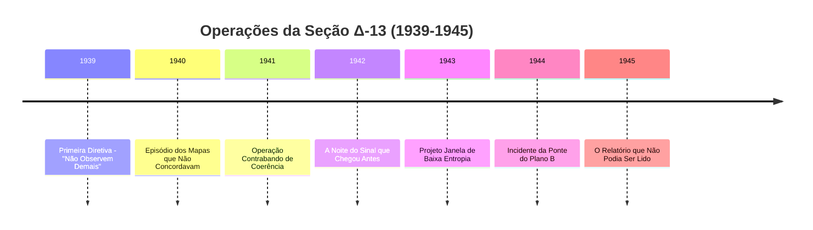
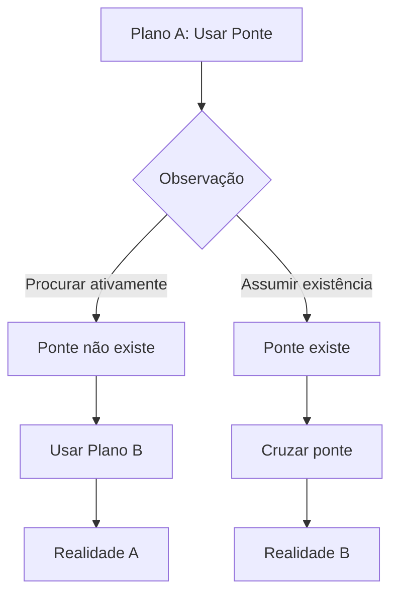

# 🎖️ Operações da Segunda Guerra Mundial

[](https://github.com/0xpbl/.github)
[](https://github.com/0xpbl/.github)
[](https://github.com/0xpbl/.github)
[](https://github.com/0xpbl/.github)

> *"Observe o necessário. Registre tudo. Não tente entender durante o evento. Entender é para o pós-guerra."*  
> — Primeira Diretiva, Dr. K., 1939

## 📋 Índice

- [Visão Geral](#-visão-geral)
- [Codinome: Seção Δ-13](#-codinome-seção-δ-13)
- [Cronologia de Operações](#-cronologia-de-operações)
- [Operações Documentadas](#-operações-documentadas)
- [Legado e Impacto](#-legado-e-impacto)
- [Documentos Classificados](#-documentos-classificados)

## 🌍 Visão Geral

Durante a Segunda Guerra Mundial, o QEL@0xpblab ainda não existia **"oficialmente"**. Isso, aliás, era uma de suas principais vantagens operacionais:

- ❌ Não constava em mapas
- ❌ Não tinha orçamento formal
- ❌ Não tinha autorização clara
- ✅ Tinha papel timbrado com data ilegível

### 🎯 Objetivos

| Objetivo Declarado | Objetivo Real |
|-------------------|---------------|
| Reduzir erro de medição em tempos de crise | Evitar que a realidade colapsasse no pior ramo possível por falta de documentação |

## 🔐 Codinome: Seção Δ-13

Entre **1939 e 1945**, o laboratório operou sob o codinome **Seção Δ-13**, uma "unidade de metrologia avançada" alocada em:

- 📚 Anexos de universidades
- 🚂 Depósitos ferroviários
- 🏢 Salas de reunião que estavam sempre vazias quando alguém tentava vistoriar

### 📊 Estrutura Operacional

```
┌─────────────────────────────────────────────────────┐
│  SEÇÃO Δ-13 (1939-1945)                             │
├─────────────────────────────────────────────────────┤
│                                                      │
│  Comando: Dr. K. (não identificado)                 │
│  Localização: Múltiplas (em superposição)           │
│  Orçamento: Não-formal                              │
│  Autorização: Data ilegível                         │
│  Cobertura: "Metrologia Avançada"                   │
│                                                      │
└─────────────────────────────────────────────────────┘
```

---

## 📅 Cronologia de Operações



---

## 🎯 Operações Documentadas

### 1️⃣ 1939: A Primeira Diretiva — "Não Observem Demais"

<div align="center">


</div>

#### 📜 O Protocolo

O primeiro protocolo de guerra do QEL@0xpblab foi assinado por uma autoridade não identificada (um **"Dr. K."** aparece em notas marginais):

```
┌─────────────────────────────────────────────────────┐
│  PRIMEIRA DIRETIVA DE GUERRA                        │
├─────────────────────────────────────────────────────┤
│                                                      │
│  1. Observe o necessário.                           │
│  2. Registre tudo.                                  │
│  3. Não tente entender durante o evento.            │
│     Entender é para o pós-guerra.                   │
│                                                      │
└─────────────────────────────────────────────────────┘
```

#### 🎯 Lógica Operacional

A lógica era pragmática: em cenários de alta instabilidade, **"entender" antes de registrar** gerava interpretações precipitadas — e interpretações precipitadas, segundo o laboratório, eram o método mais rápido de criar um desastre coerente.

#### 💡 Princípio Fundamental

> "Em guerra, a observação prematura é mais perigosa que a ignorância temporária."

---

### 2️⃣ 1940: O Episódio dos Mapas que Não Concordavam

<div align="center">


</div>

#### 🗺️ O Problema

Em 1940, um comando aliado recebeu **três mapas da mesma região**, todos supostamente atualizados, e nenhum era compatível com os outros:

- 🛣️ Estradas surgiam e desapareciam
- 🌉 Pontes existiam apenas em versões "de boas intenções"
- 📍 Coordenadas não coincidiam

**Suspeita inicial:** Sabotagem  
**Conclusão do QEL@0xpblab:** Algo mais inconveniente

#### 🔬 Diagnóstico

A cartografia estava sendo afetada por **"decoerência logística"** — a realidade local se ajustava mais rápido do que a tinta.

#### ✅ Solução: Protocolo de Cartografia Probabilística

```javascript
// Protocolo de Cartografia Probabilística
class MapaProbabilistico {
  constructor() {
    this.camadas = [
      { plausibilidade: 0.8, descricao: "Rota principal" },
      { plausibilidade: 0.6, descricao: "Rota alternativa A" },
      { plausibilidade: 0.4, descricao: "Rota alternativa B" }
    ];
  }
  
  escolherRota() {
    // Regra: escolher a rota com melhor redundância de confirmação,
    // não a que parece "mais correta"
    return this.camadas
      .filter(c => c.confirmacoes >= 2)
      .sort((a, b) => b.plausibilidade - a.plausibilidade)[0];
  }
}
```

**Características:**
- 📊 Mapas com camadas alternativas
- 🎯 Marcadas por "faixas de plausibilidade"
- ✅ Regra operacional: sempre escolher a rota com melhor redundância de confirmação

#### 📝 Registro Oficial

**Oficialmente:** "Melhoria metodológica"  
**Extraoficialmente:** Primeiro uso documentado da tese do QEL@0xpblab de que **a guerra não altera apenas fronteiras; altera a capacidade do mundo de ser descrito**.

---

### 3️⃣ 1941: O Contrabando de Coerência

<div align="center">


</div>

#### 📦 A Operação

Em 1941, o laboratório passou a operar uma linha de suprimento peculiar:

**Não transportava:**
- ❌ Armas
- ❌ Comida
- ❌ Munição

**Transportava:**
- ✅ Padrões de calibração
- ✅ Micropesos
- ✅ Réguas
- ✅ Osciladores
- ✅ Relógios de referência

#### 🎯 Justificativa Oficial

"Padronização industrial"

#### 🔬 Princípio Real

```
┌─────────────────────────────────────────────────────┐
│  TEORIA DO CONTRABANDO DE COERÊNCIA                 │
├─────────────────────────────────────────────────────┤
│                                                      │
│  Sem padrões → Cada unidade mede por conta própria  │
│                                                      │
│  Medindo por conta própria → Cada unidade confirma  │
│                               uma realidade diferente│
│                                                      │
│  Realidades incompatíveis → Perda de                │
│                             interoperabilidade       │
│                                                      │
│  Resultado: Risco adicional, mais sutil             │
│                                                      │
└─────────────────────────────────────────────────────┘
```

#### 💬 Filosofia Operacional

> "Se unidades críticas confirmarem realidades incompatíveis, o conflito terá um risco adicional, mais sutil: a perda de interoperabilidade entre as próprias causas."

O QEL@0xpblab chamava isso de **Contrabando de Coerência**. E fazia com zelo quase religioso.

---

### 4️⃣ 1942: A Noite do Sinal que Chegou Antes

<div align="center">


</div>

#### 📡 O Evento

Em 1942, um centro de comunicações registrou um evento impossível:

**Um sinal codificado foi anotado como recebido ANTES de ser transmitido.**

#### 📋 Resposta Inicial

Os registros foram tratados como **erro humano** e arquivados.

#### 🔬 Análise do QEL@0xpblab

O laboratório exigiu os logs originais e concluiu que havia ocorrido um fenômeno raro em ambientes de ruído extremo:

**Adiantamento estatístico por alinhamento de fase**

Em termos práticos: o sistema **"achou" o padrão certo cedo demais**.

#### ✅ Contramedida: Procedimento de Atraso Deliberado

```python
# Procedimento de Atraso Deliberado
def processar_sinal(sinal):
    if sinal.confianca > 0.99 and sinal.timestamp < tempo_transmissao:
        # Sinal "certo demais" chegou antes da hora
        adicionar_ruido_controlado(sinal)
        atrasar_processamento(delta_minimo)
        
    return sinal

def adicionar_ruido_controlado(sinal):
    """
    Inserir ruído controlado mínimo para impedir que mensagens
    "certas demais" apareçam antes da hora
    """
    sinal.dados += ruido_gaussiano(amplitude=MINIMA)
```

#### ⚠️ Razão

Mensagens que chegavam "cedo demais" causavam:
- 😰 Pânico
- 🤔 Paranoia
- ❌ Decisões tomadas com base em um futuro que ainda não tinha sido validado

#### 💬 Frase Histórica

É desta época a frase que depois reapareceria na Guerra Fria do Emaranhamento:

> **"Se a mensagem é perfeita, desconfie: ela pode ter sido enviada pelo próximo turno da causalidade."**

---

### 5️⃣ 1943: O Projeto "Janela de Baixa Entropia"

<div align="center">


</div>

#### 🎯 Objetivo

Criar períodos curtos — **minutos, às vezes segundos** — em que uma instalação poderia operar com ruído e variação reduzidos.

**Finalidade:**
- Testar componentes sensíveis
- Tomar decisões críticas
- Evitar que o ambiente "contaminasse" o resultado

#### 🔧 Técnicas Empregadas

##### Técnicas Ortodoxas:
- 🌡️ Isolamento térmico
- 🛡️ Blindagem eletromagnética
- 📊 Controle ambiental rigoroso

##### Técnica Menos Ortodoxa:
- 👁️ **Controle do observador**

#### 🧠 Teoria do Observador

```
┌─────────────────────────────────────────────────────┐
│  EFEITO DO OBSERVADOR EM AMBIENTES CRÍTICOS         │
├─────────────────────────────────────────────────────┤
│                                                      │
│  Pessoas demais em uma sala → Mudam o sistema       │
│  Pessoas ansiosas → Mudam MAIS ainda                │
│                                                      │
│  Solução: "Observadores Neutros"                    │
│                                                      │
│  Funcionários treinados para não reagirem           │
│  emocionalmente a leituras que pareciam absurdas    │
│                                                      │
└─────────────────────────────────────────────────────┘
```

#### 📝 Status Oficial

Relatórios posteriores afirmam que o projeto **"não existiu"**.

O que, para o QEL@0xpblab, é frequentemente um sinal de **sucesso**.

---

### 6️⃣ 1944: O Incidente da Ponte que Só Existia no Plano B

<div align="center">


</div>

#### 🌉 O Evento

Na primavera de 1944, um destacamento precisava cruzar um rio onde uma ponte era:
- ✅ **Confirmada** por inteligência
- ❌ **Não confirmada** por reconhecimento

#### 📋 Primeira Unidade

**Ao chegar ao local:** A ponte não estava lá.

**Registro do comandante:** "Ponte destruída"

**Ação:** Seguiu para a alternativa.

#### 📋 Segunda Unidade

**Horas depois:** Outra unidade reportou ter atravessado **a mesma ponte, intacta, no mesmo dia**.

#### 🔬 Classificação do QEL@0xpblab

**Bifurcação logística**

Um caso em que decisões locais (incluindo o próprio ato de procurar a ponte) influenciaram qual ramo da realidade se tornaria operacionalmente acessível.

#### 📖 Lição Incorporada

Adicionada ao manual interno:

> **"Planos não são contingências. Planos são estados quânticos concorrentes."**

#### 🎯 Implicação Operacional



---

### 7️⃣ 1945: O Pós-Guerra e o Relatório que Não Podia Ser Lido

<div align="center">


-orange)

</div>

#### 📄 O Documento

No final de 1945, a Seção Δ-13 produziu o documento que mais tarde viraria lenda:

**Título oficial:**  
*Relatório de Coerência em Teatro de Alta Instabilidade*

**Título popular:**  
**O Relatório que Não Podia Ser Lido**

#### ❓ Por Que "Não Podia Ser Lido"?

Não por sigilo — mas porque, **ao ser copiado, o texto mudava pequenas partes**:

- 🔢 Números alternavam
- 📅 Datas invertiam
- 👤 Nomes apareciam como iniciais diferentes

#### 🔬 Explicações

| Explicação Oficial | Explicação do QEL@0xpblab |
|-------------------|---------------------------|
| Falha de reprodução | O relatório estava tão próximo dos eventos e tão cheio de observações que se tornara, em si, um **objeto sensível a observação** — um documento em superposição editorial |

#### 📁 Desclassificação Peculiar

O relatório foi "desclassificado" de um modo peculiar:

1. Foi encadernado
2. Foi lacrado
3. Foi catalogado na gaveta **"Metafísica / Contabilidade"**

**Objetivo:** Qualquer auditor do futuro poderia encontrá-lo e, ao tentar lê-lo, descobrir o que o laboratório já sabia desde 1939.

#### 💡 Lição Final

```
┌─────────────────────────────────────────────────────┐
│  VERDADE FUNDAMENTAL DA GUERRA QUÂNTICA             │
├─────────────────────────────────────────────────────┤
│                                                      │
│  Em guerra, vencer é também escolher o ramo certo   │
│  da realidade — e manter logs suficientes para      │
│  provar que ele aconteceu.                          │
│                                                      │
└─────────────────────────────────────────────────────┘
```

---

## 🏆 Legado e Impacto

### Contribuições Duradouras

| Contribuição | Descrição | Uso Posterior |
|-------------|-----------|---------------|
| **Primeira Diretiva** | "Observe, registre, não entenda" | Base de todos os protocolos QEL |
| **Cartografia Probabilística** | Mapas com faixas de plausibilidade | Guerra Fria, GPS moderno |
| **Contrabando de Coerência** | Distribuição de padrões de medição | Metrologia internacional |
| **Atraso Deliberado** | Ruído controlado em sinais perfeitos | Criptografia quântica |
| **Janela de Baixa Entropia** | Controle de observadores | Experimentos sensíveis |
| **Bifurcação Logística** | Planos como estados quânticos | Planejamento estratégico |
| **Protocolo de Amplificação Controlada** | Evolução da Primeira Diretiva | Combate aos 4 vilões com música estruturada |

### 📊 Impacto Estatístico

```
Operações realizadas: [CLASSIFICADO]
Realidades estabilizadas: [CLASSIFICADO]
Desastres evitados: [CLASSIFICADO]
Documentos produzidos: 1 (ilegível)
```

---

## 📚 Documentos Classificados

### Arquivo Principal

**Localização:**
```
QEL@0xpblab — Arquivos 'Metafísica / Contabilidade'
Travessa do Colapso, Lote ∞
Prateleira "Quase"
Cartório de Realidades Alternativas, Subsolo 3 (ou 4)
CEP: 1931-UNC
```

### Documentos Disponíveis

| Documento | Status | Observações |
|-----------|--------|-------------|
| Primeira Diretiva (1939) | ✅ Desclassificado | Legível |
| Protocolo Cartográfico (1940) | ✅ Desclassificado | Legível |
| Logs de Contrabando (1941) | ⚠️ Parcialmente | Alguns trechos em superposição |
| Relatório do Sinal (1942) | ✅ Desclassificado | Legível (com atraso) |
| Projeto Janela (1943) | ❌ Não existe | Oficialmente |
| Incidente da Ponte (1944) | ✅ Desclassificado | Duas versões disponíveis |
| Relatório Final (1945) | ⚠️ Desclassificado | **Ilegível** |

### 🔐 Acesso aos Documentos

Para solicitar acesso aos documentos históricos:

**Email:** archives@qel.0xpblab.org  
**Assunto:** "Solicitação de Acesso - Seção Δ-13"

**Nota:** Peça pelo Memorando do Gato Não-Assinado; entregue sem observar.

---

## 🎖️ Reconhecimentos

### Participantes Conhecidos

- **Dr. K.** - Autor da Primeira Diretiva (identidade não confirmada)
- **Seção Δ-13** - Equipe operacional (nomes classificados)
- **Observadores Neutros** - Projeto Janela (treinamento classificado)

### Agradecimentos Especiais

- 🙏 Às unidades que usaram mapas probabilísticos sem questionar
- 🙏 Aos operadores de rádio que aceitaram o "atraso deliberado"
- 🙏 Aos comandantes que entenderam que planos são estados quânticos
- 🙏 À ponte que existiu quando foi necessário

---

## 📚 Documentos Relacionados

### Arquivos Históricos

- 🏠 [README Principal](qel.md) - História completa do QEL@0xpblab
- ❄️🔥 [Guerra Quente-Morna](COLD-WAR.md) - Evolução dos protocolos pós-guerra
- 🦹 [Dossiê de Vilões](VILLAINS.md) - Ameaças que os protocolos combatem
- 🔮🎸 [Profeta ~~Ri~~ck com Fu Monilson](FU-MONILSON.md) - Protocolo de Amplificação Controlada (evolução da Primeira Diretiva)
- 👔 [Pablo Mu-R4d](PABLO-MU-R4D.md) - Liderança durante e após a guerra
- 🍬🚫 [John Aunt-Bet](JOHN-AUNT-BET.md) - Primeira menção em memorando da Seção Δ-13

### Referências Internas

- **Primeira Diretiva**: Base para todos os protocolos QEL, incluindo o [Protocolo de Amplificação Controlada](FU-MONILSON.md#-protocolo-de-amplificação-controlada)
- **Atraso Deliberado**: Precursor do [Ruído Diplomático Mínimo](COLD-WAR.md#5️⃣-1978-1986-a-guerra-fria-do-emaranhamento)

---

## 📞 Contato

Para mais informações sobre as operações históricas do QEL@0xpblab:

- **Email:** history@qel.0xpblab.org
- **Arquivo:** archives@qel.0xpblab.org
- **Website:** [https://0xpblab.quantum/history](https://0xpblab.quantum/history)

---

<div align="center">

### 🎖️ Lema da Seção Δ-13

**"Observe o necessário. Registre tudo. Entenda depois."**

---

*Em memória das operações que nunca existiram oficialmente,  
mas que mantiveram a realidade coerente quando mais importava.*

**1939 - 1945**

[](qel.md)

</div>
