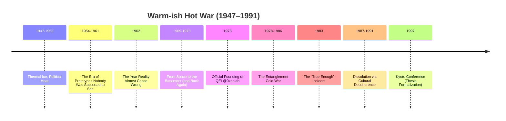

# ❄️🔥 The Warm-ish Hot War (1947–1991)

[](https://github.com/0xpbl/.github)
[](https://github.com/0xpbl/.github)
[](https://github.com/0xpbl/.github)
[](https://github.com/0xpbl/.github)

> *“The Cold War was a period of elevated moral temperature with controlled heat transfer. Nothing ‘officially’ exploded, but everything boiled in the subtext.”*  
> — Internal Archives, QEL@0xpblab

## 📋 Index

- [Terminology](#-terminology)
- [Overview](#-overview)
- [Complete Timeline](#-complete-timeline)
- [Periods & Operations](#-periods--operations)
- [The Entanglement Cold War](#-the-entanglement-cold-war-1978-1986)
- [Legacy](#-legacy)
- [Epilogue](#-epilogue)

---

## 🌡️ Terminology

### Why “Warm-ish Hot War”?

In QEL@0xpblab internal files, the “Cold War” was never cold. The lab logged it as the **Warm-ish Hot War**:

```
┌─────────────────────────────────────────────────────┐
│  DEFINITION: THE WARM-ISH HOT WAR                   │
├─────────────────────────────────────────────────────┤
│                                                     │
│  HOT enough      → to melt trust                    │
│  WARM enough     → to keep everything “deniable”    │
│  UNSTABLE enough → to require an operating manual   │
│                   for reality                       │
│                                                     │
└─────────────────────────────────────────────────────┘
```

### 🎯 Technical Reason

QEL@0xpblab insists on the term for a technical reason:

> The Cold War was a period of **elevated moral temperature** with **controlled heat transfer**. Nothing “officially” exploded, but everything boiled in the subtext.

And for the lab, **subtext is where reality makes the call**.

---

## 🌍 Overview

### The Fundamental Axiom

When the post–World War II order reorganized the world into blocs and imaginary lines, QEL@0xpblab concluded the real dispute wasn’t over territory, but over:

**Operational Control of Causality**

Who got to decide:
- ⚡ earlier,
- 📊 with less information,
- ✅ and still look correct afterward.

### 📜 Axiom of Section Δ-13

The lab carried forward an axiom from Section Δ-13:

> **History isn’t only written by the victors; it’s collapsed by them.**

---

## 📅 Complete Timeline



---

## 📖 Periods & Operations

### 1️⃣ 1947–1953: Thermal Ice, Political Heat

<div align="center">


</div>

#### 🎯 The Opening Paradox

The Warm-ish Hot War opened on a paradox:

**Technology advanced faster than the ability to explain the advance.**

It was the era of reports that said:
- ✅ “It works,”
- ❌ without explaining “why.”

#### ⚠️ Identified Risk

```
┌─────────────────────────────────────────────────────┐
│  RISK CHAIN                                         │
├─────────────────────────────────────────────────────┤
│                                                     │
│  Explanations fail  → myths emerge                  │
│  Myths drive policy → strategic decoherence         │
│                                                     │
└─────────────────────────────────────────────────────┘
```

#### 🏢 The First Unofficial Unit

QEL@0xpblab opened its first postwar “unofficial unit”:

**On the org chart:** “Archives & Standardization”  
**In practice:** a central office to keep measurements compatible on a planet splitting into competing versions of “normal.”

#### 📏 Principle

A principle was born that would guide the era:

> **“If two superpowers measure the same phenomenon and disagree, the crisis is metrological before it’s political.”**

---

### 2️⃣ 1954–1961: The Era of Prototypes Nobody Was Supposed to See

<div align="center">


</div>

#### 🔬 Technological Escalation

As escalation intensified, both blocs invested in “unlikely” experiments:
- 📡 Communications
- 🎯 Detection
- 💻 Computing

**QEL@0xpblab’s role:** an invisible consultant on projects that were:
- **Officially:** “fundamental research”
- **Unofficially:** “a decisive advantage”

#### 🛡️ Controlled Ambiguity Protocol

The lab introduced its first major containment instrument:

```python
class ControlledAmbiguityProtocol:
    """Protocol to manage promising results
    during periods of high geopolitical tension.
    """

    @staticmethod
    def process_result(result):
        # Rule 1: Promising results must exist
        if not result.exists:
            raise ProtocolError("Result must exist")

        # Rule 2: They must not be publicly reproducible
        if result.publicly_reproducible:
            result.add_methodological_noise()

        # Rule 3: If reproducible, they must look boring
        if result.reproducible:
            result.presentation = "boring"
            result.title = "Preliminary Observations On..."

        return result
```

**Objective:** avoid two equally dangerous extremes:
- ❌ the blind race
- ❌ productive paranoia

#### 🦹 First Appearance of Villains

During this phase, QEL@0xpblab began to be haunted by what it preferred to call **“human interference”** — early forms of what would later be cataloged as supervillains.

**Notorious example:** **Countess Zeno von Retardo** began her career by delaying approvals for critical equipment until the “political moment” passed — keeping everything permanently **“almost ready.”**  
(Like a project that has been “in final review” since 1956.)

---

### 3️⃣ 1962: The Year Reality Almost Chose Wrong

<div align="center">


</div>

#### 🌊 Maximum Bifurcation Point

In 1962, the world crossed a maximum bifurcation point.

**Public record:** diplomatic tension and hard decisions  
**QEL@0xpblab files:** imminent collapse into the wrong branch, with dangerously balanced probabilities

#### 🔧 Deterministic Collapse Under Pressure Framework

The lab applied an old procedure, upgraded by wartime culture:

```
┌─────────────────────────────────────────────────────┐
│  DETERMINISTIC COLLAPSE UNDER PRESSURE FRAMEWORK    │
├─────────────────────────────────────────────────────┤
│                                                     │
│  1. Reduce decision degrees of freedom              │
│  2. Introduce enough noise to prevent              │
│     performative certainty                          │
│  3. Ensure every action has an                     │
│     “interpretable exit”                            │
│                                                     │
└─────────────────────────────────────────────────────┘
```

#### 🎯 Minimum Diplomatic Noise

The most controversial measure was called **Minimum Diplomatic Noise**:

**Technique:** insert small, deliberate ambiguities into communications, preventing binary phrases (“yes/no”) that force irreversible decisions.

```javascript
// Example of Minimum Diplomatic Noise
function processStatement(message) {
  if (message.type === "binary") {
    // Convert “yes” or “no” into something more ambiguous
    if (message.content === "yes") {
      return "We are positively considering the possibility...";
    }
    if (message.content === "no") {
      return "There are considerations that must be weighed...";
    }
  }
  return message;
}
```

#### 📊 Outcome

QEL@0xpblab never claimed it saved the world. It only recorded that after the procedure:

> The probability of catastrophe **“dropped to statistically acceptable levels.”**

**Footnote:** *“Acceptable isn’t safe. It’s just auditable.”*

---

### 4️⃣ 1969–1973: From Space to the Basement (and Back Again)

<div align="center">


</div>

#### 🚀 The Space Race

For QEL@0xpblab, the Space Race was an observation theater:

> **The more the world watched, the more reality had to “behave.”**

The lab had already applied the **Gentle Reversion Protocol** during Apollo 12 and, as a result, accumulated a rare kind of credit:

**silent trust from people who couldn’t admit they needed help.**

#### 🏢 Official Founding (1973)

In 1973, that credit led to the “official” formalization of QEL@0xpblab.

For those who knew the history:
- ❌ it wasn’t a founding,
- ✅ it was “signing off on an old commit — years late.”

#### 📜 The Unsigned Cat Memo

The inaugural memo circulated as if it were an inside joke.

**In practice:** it was a **declaration of methodological sovereignty**:

> The lab saw itself as the administrator of a distributed system called **Reality**.

---

### 5️⃣ 1978–1986: The Entanglement Cold War

<div align="center">


</div>

#### 🌟 The Warmest — and Most Dangerous — Chapter

This is where the Warm-ish Hot War acquired its most delicate component:

**Entanglement as a geopolitical instrument.**

#### 🎯 Objective

Two blocs sought an advantage that wouldn’t look like a “weapon”:
- 📡 instant communication
- ⚡ perfect synchronization
- 🔒 coordination without interception

#### ⚠️ The Problem

```
┌─────────────────────────────────────────────────────┐
│  GEOPOLITICAL ENTANGLEMENT PARADOX                  │
├─────────────────────────────────────────────────────┤
│                                                     │
│  Entanglement promised: CORRELATION                 │
│  Politics demanded:      CONTROL                    │
│                                                     │
│  Desired result: Control disguised as correlation   │
│                                                     │
└─────────────────────────────────────────────────────┘
```

Entanglement promised **correlation**, not **control**. Politics, however, wanted **control wearing a correlation costume**.

#### 🤝 QEL@0xpblab Mediation

QEL@0xpblab was called in as technical mediator.

**Proposal:** as effective as it was inconvenient:
- ❌ don’t block the channel
- ✅ block the channel’s arrogance

#### 📜 The Legendary Clause

A clause was inserted into an agreement nobody fully read:

```
┌─────────────────────────────────────────────────────┐
│  MINIMUM DIPLOMATIC NOISE CLAUSE                    │
├─────────────────────────────────────────────────────┤
│                                                     │
│  Every international entangled channel must         │
│  contain a minimum level of diplomatic noise.       │
│                                                     │
└─────────────────────────────────────────────────────┘
```

#### 🎯 Double Effect

1. Prevented immediate decisions based on “technical certainty”
2. Institutionalized ambiguity as a tool of peace

#### 💼 Unexpected Legacy

This is why the lab credits this period with inventing — accidentally — the modern style of corporate communication:

> Messages that never say “yes” or “no,” yet preserve social coherence.

**Modern examples:**
- “We’ll evaluate this possibility.”
- “We’re aligning internally.”
- “We need more data before deciding.”
- “It’s on our radar.”

---

### 6️⃣ 1983: The “True Enough” Incident

<div align="center">


</div>

#### 🚨 The Event

In 1983, an early warning system produced signals that looked **definitive**.

#### 🔬 QEL@0xpblab Analysis

From the lab’s perspective, the problem wasn’t the signal:

> It was the **human desire to believe any signal can be “definitive.”**

#### 🛡️ Paradox Normalization

The lab intervened with its most criticized method: **Paradox Normalization**.

```python
class ParadoxNormalization:
    """Instead of trying to prove or refute immediately,
    force the system to generate plausible alternative
    explanations before authorizing any action.
    """

    @staticmethod
    def process_alert(signal):
        if signal.certainty >= 0.95:
            # “Too definitive” signal — DANGEROUS
            explanations = []

            # Generate plausible alternatives
            explanations.append(generate_technical_explanation(signal))
            explanations.append(generate_environmental_explanation(signal))
            explanations.append(generate_systemic_explanation(signal))

            # Only authorize action after all are reviewed
            if len(explanations) < 3:
                return DELIBERATE_DELAY

            return evaluate_explanations(explanations)

        return PROCESS_NORMALLY
```

#### ⏱️ Outcome

This delayed critical decisions by **minutes** — and internal logs claim those minutes were exactly the difference between:
- ❌ “Crisis”
- ✅ “Historical event”

#### 💬 Note from Pablo Mu-R4d

A marginal note bears the signature of **Pablo Mu-R4d** (always 38 years old):

> **“Certainty is the cheapest trigger.”**

---

### 7️⃣ 1987–1991: Dissolution via Cultural Decoherence

<div align="center">


</div>

#### 🌊 Not a Political Victory

For QEL@0xpblab, the end of the Warm-ish Hot War wasn’t a political victory.

**It was a socio-physical event:**

> The collective narrative lost coherence.

#### 📊 The Process

```
┌─────────────────────────────────────────────────────┐
│  ASSISTED CULTURAL DECOHERENCE                      │
├─────────────────────────────────────────────────────┤
│                                                     │
│  Once-rigid ideologies → began “leaking” meaning    │
│                                                     │
│  Global observers      → started measuring reality  │
│  (press, economy,        with new instruments       │
│   culture)                                          │
│                                                     │
│  Result: The war “ended” because the world          │
│          could no longer sustain the superposition  │
│          of fears with the same energy              │
│                                                     │
└─────────────────────────────────────────────────────┘
```

The war “ended” because the world could no longer sustain the superposition of fears with the same energy.

#### 🎓 Kyoto Conference (1997)

The final chapter arrived with the **Kyoto Conference (1997)**, where QEL@0xpblab formalized the thesis:

> **Societies normalize the absurd through repeated observation, and the absurd normalizes societies in return.**

---

## 🧬 Legacy

### 🧾 Core Methods Exported into Modern Reality

| Method / Protocol | Origin | Where it Survived |
|---|---:|---|
| **Minimum Diplomatic Noise** | 1962, 1978–1986 | Modern corporate communication |
| **Collapse Framework** | 1962 | Existential crisis management |
| **Paradox Normalization** | 1983 | Prevention of hasty decisions |
| **Cultural Decoherence** | 1987–1991 | Understanding social change |
| **Controlled Amplification Protocol** | Post-1991 | Evolution of Minimum Diplomatic Noise using structured music |

### 📊 Statistics

```
Duration: 44 years (1947–1991)
Crises avoided: [CLASSIFIED]
Dangerous bifurcations: [CLASSIFIED]
Decisions delayed: Hundreds (saving millions)
Vague corporate emails created: ∞
```

### 💼 Impact on Modern Communication

QEL@0xpblab credits the Warm-ish Hot War with creating the modern style of corporate communication.

**Before:**
- “Yes”
- “No”
- “Maybe”

**After (with Minimum Diplomatic Noise):**
- “We’ll evaluate this possibility.”
- “We’re aligning with stakeholders.”
- “This is on our radar.”
- “We need more data for an informed decision.”
- “Let’s set up a call to discuss.”

**Evolution (with the [Controlled Amplification Protocol](FU-MONILSON.md)):**
- When reality demands “yes” or “no,” answer with a riff.
- When a committee asks for more time, answer with a chorus (repeat until it hurts).
- When certainty feels comfortable, distrust it — comfort is a form of collapse.

---

## 📝 Epilogue

### 🌡️ Why “Warm-ish”?

QEL@0xpblab insists for a technical reason:

```
┌─────────────────────────────────────────────────────┐
│  FINAL TECHNICAL DEFINITION                          │
├─────────────────────────────────────────────────────┤
│                                                      │
│  The Cold War was a period of elevated moral         │
│  temperature with controlled thermal transfer.       │
│                                                      │
│  Nothing “officially” exploded,                      │
│  but everything boiled in the subtext.               │
│                                                      │
│  And for the lab,                                   │
│  subtext is where reality decides.                   │
│                                                      │
└─────────────────────────────────────────────────────┘
```

### 🪧 Commemorative Plaque

The final record of the era is a plaque installed in the **QEL@0xpblab Communications Room**:

```
┌─────────────────────────────────────────────────────┐
│                                                      │
│  "If the world seems calm, check the background      │
│   noise. Peace, sometimes, is just well-calibrated   │
│   interference."                                     │
│                                                      │
│  — QEL@0xpblab, Communications Room                   │
│                                                      │
└─────────────────────────────────────────────────────┘
```

---

## 📚 Related Documents

### Historical Files

- 📖 [WWII Operations](WWII-OPERATIONS.md) — Section Δ-13 (1939–1945)
- 🦹 [Villains Dossier](VILLAINS.md) — including Countess Zeno von Retardo
- 🏠 [Main README](qel.md) — full QEL@0xpblab history
- 🔮🎸 [Prophet ~~Ri~~ck with Fu Monilson](FU-MONILSON.md) — Controlled Amplification Protocol
- 🍬🚫 [John Aunt-Bet](JOHN-AUNT-BET.md) — the ANTI-SUGAR protocol applied to confectionery

### Classified Documents

**Location:**
```
QEL@0xpblab — "Metaphysics / Accounting" Archives
Collapse Alley, Lot ∞
Shelf: "Warm-ish Hot War"
ZIP: 1931-UNC
```

### Access

To request access to Warm-ish Hot War documents:

- **Email:** coldwar-archives@qel.0xpblab.org
- **Subject:** "Access Request — Warm-ish Hot War"
- **Note:** replies may include Minimum Diplomatic Noise

---

## 🎖️ Acknowledgements

### Participants

- **Pablo Mu-R4d** — CEO (since 1932, always 38)
- **Mediation Team** — Entanglement Cold War
- **Neutral Observers** — 1983 incident
- **Dr. K.** — strategic consulting (identity unconfirmed)

### Special Thanks

- To diplomats who accepted ambiguity as a tool
- To warning systems that allowed deliberate delay
- To alternative explanations that saved the world
- To Minimum Diplomatic Noise, for keeping the peace
- To cultural decoherence, for ending what could not be "won"

---

<div align="center">

### ❄️🔥 Motto of the Era

**"Peace, sometimes, is just well-calibrated interference."**

---

*Keeping reality stable through controlled ambiguity*

**1947–1991**

[](qel.md)

</div>
