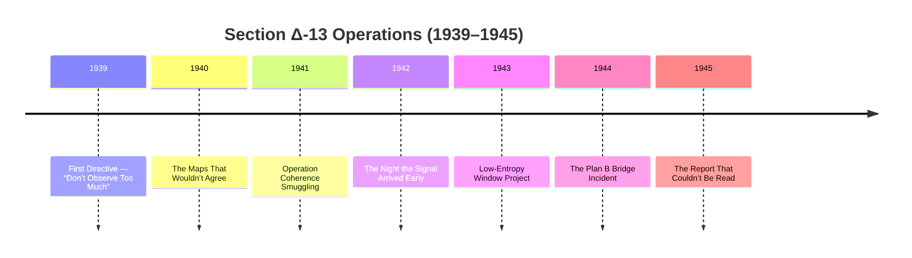
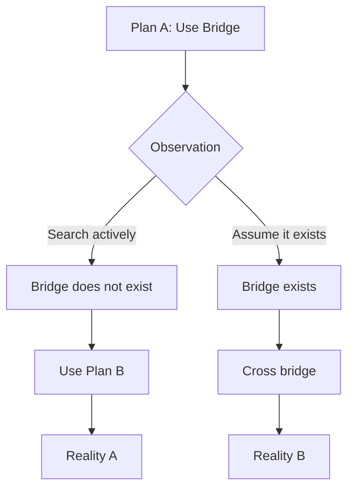

# 🎖️ World War II Operations

[](https://github.com/0xpbl/.github)
[](https://github.com/0xpbl/.github)
[](https://github.com/0xpbl/.github)
[](https://github.com/0xpbl/.github)

> *“Observe what is necessary. Log everything. Do not try to understand during the event. Understanding is for the postwar.”*  
> — First Directive, Dr. K., 1939

## 📋 Index

- [Overview](#-overview)
- [Codename: Section Δ-13](#-codename-section-δ-13)
- [Operations Timeline](#-operations-timeline)
- [Documented Operations](#-documented-operations)
- [Legacy & Impact](#-legacy--impact)
- [Classified Documents](#-classified-documents)

## 🌍 Overview

During World War II, QEL@0xpblab did not exist **“officially.”** Which, incidentally, was one of its main operational advantages:

- ❌ Not on maps  
- ❌ No formal budget  
- ❌ No clear authorization  
- ✅ Letterhead with an illegible date  

### 🎯 Objectives

| Stated Objective | Actual Objective |
|---|---|
| Reduce measurement error in times of crisis | Prevent reality from collapsing into the worst possible branch due to a lack of documentation |

## 🔐 Codename: Section Δ-13

Between **1939 and 1945**, the lab operated under the codename **Section Δ-13**, an “advanced metrology unit” deployed across:

- 📚 university annexes  
- 🚂 railway depots  
- 🏢 meeting rooms that were always empty whenever anyone tried to inspect them  

### 📊 Operational Structure

```
┌─────────────────────────────────────────────────────┐
│  SECTION Δ-13 (1939–1945)                           │
├─────────────────────────────────────────────────────┤
│                                                     │
│  Command: Dr. K. (unidentified)                     │
│  Location: Multiple (in superposition)              │
│  Budget: Non-formal                                 │
│  Authorization: Illegible date                      │
│  Cover: “Advanced Metrology”                        │
│                                                     │
└─────────────────────────────────────────────────────┘
```

---

## 📅 Operations Timeline



---

## 🎯 Documented Operations

### 1️⃣ 1939: The First Directive — “Don’t Observe Too Much”

<div align="center">


</div>

#### 📜 The Protocol

The first wartime protocol of QEL@0xpblab was signed by an unidentified authority (a **“Dr. K.”** appears in marginal notes):

```
┌─────────────────────────────────────────────────────┐
│  FIRST WARTIME DIRECTIVE                            │
├─────────────────────────────────────────────────────┤
│                                                     │
│  1. Observe what is necessary.                      │
│  2. Log everything.                                 │
│  3. Do not try to understand during the event.      │
│     Understanding is for the postwar.               │
│                                                     │
└─────────────────────────────────────────────────────┘
```

#### 🎯 Operational Logic

The logic was pragmatic: in highly unstable scenarios, **“understanding” before logging** produced premature interpretations—and premature interpretations, in the lab’s view, were the fastest way to manufacture a coherent disaster.

#### 💡 Foundational Principle

> “In war, premature observation is more dangerous than temporary ignorance.”

---

### 2️⃣ 1940: The Maps That Wouldn’t Agree

<div align="center">


</div>

#### 🗺️ The Problem

In 1940, an Allied command received **three maps of the same region**, all supposedly updated—and none of them compatible with the others:

- 🛣️ roads appeared and disappeared  
- 🌉 bridges existed only in “good intentions” editions  
- 📍 coordinates did not match  

**Initial suspicion:** sabotage  
**QEL@0xpblab conclusion:** something more inconvenient

#### 🔬 Diagnosis

Cartography was being affected by **“logistical decoherence”**—local reality was updating faster than ink.

#### ✅ Solution: Probabilistic Cartography Protocol

```javascript
// Probabilistic Cartography Protocol
class ProbabilisticMap {
  constructor() {
    this.layers = [
      { plausibility: 0.8, description: "Main route" },
      { plausibility: 0.6, description: "Alternate route A" },
      { plausibility: 0.4, description: "Alternate route B" }
    ];
  }

  chooseRoute() {
    // Rule: choose the route with the best redundancy of confirmation,
    // not the one that looks "most correct"
    return this.layers
      .filter(l => l.confirmations >= 2)
      .sort((a, b) => b.plausibility - a.plausibility)[0];
  }
}
```

**Characteristics:**
- 📊 maps with alternative layers  
- 🎯 marked with plausibility bands  
- ✅ operational rule: always choose the route with the best confirmation redundancy  

#### 📝 Official Record

**Officially:** “methodological improvement”  
**Unofficially:** the first documented use of QEL@0xpblab’s thesis that **war doesn’t only change borders; it changes the world’s ability to be described.**

---

### 3️⃣ 1941: Coherence Smuggling

<div align="center">


</div>

#### 📦 The Operation

In 1941, the lab began operating a peculiar supply line.

**It did not transport:**
- ❌ weapons  
- ❌ food  
- ❌ ammunition  

**It transported:**
- ✅ calibration standards  
- ✅ micro-weights  
- ✅ rulers  
- ✅ oscillators  
- ✅ reference clocks  

#### 🎯 Official Justification

“Industrial standardization.”

#### 🔬 The Real Principle

```
┌─────────────────────────────────────────────────────┐
│  COHERENCE SMUGGLING THEORY                         │
├─────────────────────────────────────────────────────┤
│                                                     │
│  Without standards → each unit measures on its own  │
│                                                     │
│  Measuring alone → each unit confirms a different   │
│                    reality                          │
│                                                     │
│  Incompatible realities → loss of interoperability  │
│                                                     │
│  Result: an additional, subtler risk                │
│                                                     │
└─────────────────────────────────────────────────────┘
```

#### 💬 Operational Philosophy

> “If critical units confirm incompatible realities, the conflict gains an extra, subtler risk: the loss of interoperability between causes themselves.”

QEL@0xpblab called it **Coherence Smuggling**—and treated it with nearly religious rigor.

---

### 4️⃣ 1942: The Night the Signal Arrived Early

<div align="center">


</div>

#### 📡 The Event

In 1942, a communications center recorded an impossible event:

**An encoded signal was logged as received BEFORE it was transmitted.**

#### 📋 Initial Response

The records were treated as **human error** and archived.

#### 🔬 QEL@0xpblab Analysis

The lab demanded the original logs and concluded a rare phenomenon had occurred under extreme noise:

**statistical advance via phase alignment**

In practical terms: the system **“locked onto” the right pattern too early.**

#### ✅ Countermeasure: Deliberate Delay Procedure

```python
# Deliberate Delay Procedure
def process_signal(signal):
    if signal.confidence > 0.99 and signal.timestamp < transmission_time:
        # A “too correct” signal arrived ahead of schedule
        add_minimum_controlled_noise(signal)
        delay_processing(minimum_delta)

    return signal

def add_minimum_controlled_noise(signal):
    """
    Insert minimum controlled noise to prevent messages
    that are “too correct” from showing up ahead of time.
    """
    signal.data += gaussian_noise(amplitude=MINIMUM)
```

#### ⚠️ Reason

Signals that arrived “too early” caused:
- 😰 panic  
- 🤔 paranoia  
- ❌ decisions made based on a future that had not been validated yet  

#### 💬 Historical Line

This is the era that produced a phrase that later resurfaced during the Entanglement Cold War:

> **“If the message is perfect, be suspicious: it may have been sent by the next shift of causality.”**

---

### 5️⃣ 1943: The “Low-Entropy Window” Project

<div align="center">


</div>

#### 🎯 Objective

Create short periods—**minutes, sometimes seconds**—during which a facility could operate with reduced noise and variability.

**Purpose:**
- test sensitive components  
- make critical decisions  
- prevent the environment from “contaminating” the result  

#### 🔧 Techniques Used

##### Orthodox Techniques:
- 🌡️ thermal isolation  
- 🛡️ electromagnetic shielding  
- 📊 strict environmental control  

##### Less Orthodox Technique:
- 👁️ **observer control**

#### 🧠 Observer Theory

```
┌─────────────────────────────────────────────────────┐
│  OBSERVER EFFECT IN CRITICAL ENVIRONMENTS           │
├─────────────────────────────────────────────────────┤
│                                                     │
│  Too many people in a room → they change the system │
│  Anxious people → they change it even more          │
│                                                     │
│  Solution: “Neutral Observers”                      │
│                                                     │
│  Staff trained not to react emotionally to          │
│  readings that looked absurd                        │
│                                                     │
└─────────────────────────────────────────────────────┘
```

#### 📝 Official Status

Later reports claimed the project **“did not exist.”**

Which, for QEL@0xpblab, is often a sign of **success**.

---

### 6️⃣ 1944: The Bridge That Only Existed in Plan B

<div align="center">


</div>

#### 🌉 The Event

In the spring of 1944, a detachment needed to cross a river where a bridge was:
- ✅ **confirmed** by intelligence  
- ❌ **not confirmed** by reconnaissance  

#### 📋 First Unit

**Upon arrival:** the bridge was not there.

**Commander’s record:** “Bridge destroyed.”

**Action:** proceeded to the alternative.

#### 📋 Second Unit

**Hours later:** another unit reported crossing **the same bridge, intact, on the same day.**

#### 🔬 QEL@0xpblab Classification

**logistical bifurcation**

A case where local decisions (including the act of actively searching for the bridge) influenced which branch of reality became operationally accessible.

#### 📖 Incorporated Lesson

Added to the internal manual:

> **“Plans are not contingencies. Plans are competing quantum states.”**

#### 🎯 Operational Implication



---

### 7️⃣ 1945: Postwar and the Report That Couldn’t Be Read

<div align="center">


-orange)

</div>

#### 📄 The Document

At the end of 1945, Section Δ-13 produced the document that later became legend:

**Official title:**  
*Coherence Report in a High-Instability Theater*

**Popular title:**  
**The Report That Couldn’t Be Read**

#### ❓ Why “Couldn’t Be Read”?

Not because of secrecy—but because **when copied, the text changed in small ways**:

- 🔢 numbers alternated  
- 📅 dates inverted  
- 👤 names appeared as different initials  

#### 🔬 Explanations

| Official Explanation | QEL@0xpblab Explanation |
|---|---|
| reproduction failure | the report was so close to events and so saturated with observations that it became, itself, an **observation-sensitive object**—a document in editorial superposition |

#### 📁 A Peculiar Declassification

The report was “declassified” in a peculiar way:

1. it was bound  
2. it was sealed  
3. it was cataloged in the drawer labeled **“Metaphysics / Accounting”**  

**Objective:** any future auditor could find it—and by attempting to read it, discover what the lab had known since 1939.

#### 💡 Final Lesson

```
┌─────────────────────────────────────────────────────┐
│  FUNDAMENTAL TRUTH OF QUANTUM WAR                   │
├─────────────────────────────────────────────────────┤
│                                                     │
│  In war, winning also means choosing the right      │
│  branch of reality — and keeping enough logs        │
│  to prove it happened.                              │
│                                                     │
└─────────────────────────────────────────────────────┘
```

---

## 🏆 Legacy & Impact

### Lasting Contributions

| Contribution | Description | Later Use |
|---|---|---|
| **First Directive** | “Observe, log, don’t understand” | foundation of all QEL protocols |
| **Probabilistic Cartography** | maps with plausibility bands | Cold War, modern GPS |
| **Coherence Smuggling** | distribution of measurement standards | international metrology |
| **Deliberate Delay** | controlled noise for perfect signals | quantum cryptography |
| **Low-Entropy Window** | observer control | sensitive experiments |
| **Logistical Bifurcation** | plans as quantum states | strategic planning |
| **Controlled Amplification Protocol** | evolution of the First Directive | fighting the four villains with structured music |

### 📊 Statistical Impact

```
Operations performed: [CLASSIFIED]
Realities stabilized: [CLASSIFIED]
Disasters prevented: [CLASSIFIED]
Documents produced: 1 (illegible)
```

---

## 📚 Classified Documents

### Primary Archive

**Location:**
```
QEL@0xpblab — “Metaphysics / Accounting” Archives
Collapse Alley, Lot ∞
Shelf “Almost”
Registry of Alternate Realities, Basement 3 (or 4)
ZIP: 1931-UNC
```

### Available Documents

| Document | Status | Notes |
|---|---|---|
| First Directive (1939) | ✅ Declassified | readable |
| Cartographic Protocol (1940) | ✅ Declassified | readable |
| Smuggling Logs (1941) | ⚠️ Partial | some sections in superposition |
| Signal Report (1942) | ✅ Declassified | readable (with delay) |
| Window Project (1943) | ❌ Does not exist | officially |
| Bridge Incident (1944) | ✅ Declassified | two versions available |
| Final Report (1945) | ⚠️ Declassified | **illegible** |

### 🔐 Document Access

To request access to historical documents:

**Email:** archives@qel.0xpblab.org  
**Subject:** “Access Request — Section Δ-13”

**Note:** Ask for the Unsigned Cat Memo; delivery is strictly unobserved.

---

## 🎖️ Acknowledgments

### Known Participants

- **Dr. K.** — author of the First Directive (identity unconfirmed)
- **Section Δ-13** — operational team (names classified)
- **Neutral Observers** — Window Project (training classified)

### Special Thanks

- 🙏 to the units that used probabilistic maps without arguing
- 🙏 to the radio operators who accepted “deliberate delay”
- 🙏 to the commanders who understood that plans are quantum states
- 🙏 to the bridge that existed when it needed to

---

## 📚 Related Documents

### Historical Files

- 🏠 [Main README](qel.md) — complete QEL@0xpblab history
- ❄️🔥 [Warm-ish Hot War](COLD-WAR.md) — postwar protocol evolution
- 🦹 [Villains Dossier](VILLAINS.md) — threats the protocols are designed to counter
- 🔮🎸 [Prophet ~~Ri~~ck with Fu Monilson](FU-MONILSON.md) — Controlled Amplification Protocol (evolution of the First Directive)
- 👔 [Pablo Mu-R4d](PABLO-MU-R4D.md) — leadership during and after the war
- 🍬🚫 [John Aunt-Bet](JOHN-AUNT-BET.md) — first mention in a Section Δ-13 memo

### Internal References

- **First Directive**: foundation for all QEL protocols, including the [Controlled Amplification Protocol](FU-MONILSON.md#-controlled-amplification-protocol)
- **Deliberate Delay**: precursor to [Minimum Diplomatic Noise](COLD-WAR.md#5️⃣-1978-1986-the-entanglement-cold-war)

---

## 📞 Contact

For more information about QEL@0xpblab’s historical operations:

- **Email:** history@qel.0xpblab.org
- **Archive:** archives@qel.0xpblab.org
- **Website:** [https://0xpblab.quantum/history](https://0xpblab.quantum/history)

---

<div align="center">

### 🎖️ Section Δ-13 Motto

**“Observe what is necessary. Log everything. Understand later.”**

---

*In memory of the operations that officially never existed,  
but kept reality coherent when it mattered most.*

**1939 - 1945**

[](qel.md)

</div>
