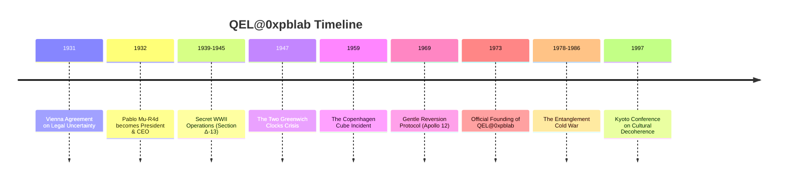

# 🔬 QEL@0xpblab - Quantum Experimental Laboratories

[](https://github.com/0xpbl/.github)
[](https://github.com/0xpbl/.github)
[](https://github.com/0xpbl/.github)
[](https://github.com/0xpbl/.github)
[](https://github.com/0xpbl/.github)

> *“Reality is a distributed system, and observation is a kind of commit.”*
> — The Unsigned Cat Memo, 1973

## 📋 Index

- [About](#-about)
- [History](#-history)
- [Participation in Historical Events](#-participation-in-historical-events)
- [Contributions](#-contributions-to-the-quantum-world)
- [The Prophet ~~Ri~~ck with Fu Monilson](#-the-prophet-rick-with-fu-monilson) 🔮🎸
- [Quantum De-Inclusion™](#-quantum-de-inclusion-the-hr-policy) 🏢
- [The Interdimensional Whiteboard Auditor](#-the-interdimensional-whiteboard-auditor) 🧾🌀
- [John Aunt-Bet](#-john-aunt-bet-the-german-swiss-anti-sugar-operator) 🍬🚫
- [Villains Dossier](#-villains-dossier) 🦹
- [TV Programs](#-tv-programs) 📺
- [Installation](#-installation)
- [How to Use](#-how-to-use)
- [Architecture](#-architecture)
- [Contributing](#-contributing)
- [Team](#-team)
- [Important Notices](#-important-notices)
- [License](#-license)
- [Contact & Addresses](#-contact--addresses)

## 🧾 About {#sobre}

The **Quantum Experimental Laboratories at 0xpblab** (QEL@0xpblab) was officially born in **1973**, in a windowless basement somewhere between physics’ “floor -1” and international bureaucracy’s “floor 256.”

**Officially:** a quantum research lab.
**Unofficially:** a meetup spot for people who believed the Universe wasn’t “weird” — just badly documented.

### 🐈 The First Document

QEL@0xpblab’s first document — the legendary **Unsigned Cat Memo** — stated, with administrative seriousness:

> “Reality is a distributed system, and observation is a kind of commit.”

That sentence was ignored for two decades, until it resurfaced in a “leaked” report (meaning: printed, bound, and hand-delivered) to a scientific committee that couldn’t decide whether to approve the idea or call an electrician.

### 👔 Quantum Leadership

Since **1932**, QEL@0xpblab’s President & CEO has been **[Pablo Mu-R4d](https://github.com/runawaydevil)** — and, in a way that is perfectly consistent with the lab’s quantum accounting, he is only **38 years old**.

The board logs this as a *“benign side effect of a rigorous youth-conservation policy via selective decoherence,”* audited annually by a committee that always arrives **too early and too late at the same time**.

> 👔 **[Read Pablo Mu-R4d’s complete biography →](PABLO-MU-R4D.md)**

## 📚 History

### Timeline



### 🎖️ WWII Operations

Between 1939 and 1945, QEL@0xpblab operated secretly under the codename **Section Δ-13**, an “advanced metrology unit” that never officially existed.

**Mission:** prevent reality from collapsing into the worst possible branch due to a lack of documentation.

**Notable operations:**
- 📜 First Directive: “Do Not Observe Too Much”
- 🗺️ Probabilistic Cartography Protocol
- 📦 Coherence Smuggling
- 📡 The Night the Signal Arrived Early
- 🌉 The Plan-B Bridge Incident

> 🎖️ **[Read the complete war-operations dossier →](WWII-OPERATIONS.md)**

### ❄️🔥 The Warm-ish Hot War (1947–1991)

QEL@0xpblab never called it the “Cold War.” Internally it is logged as the **Warm-ish Hot War**: hot enough to melt trust, warm enough to keep everything “deniable.”

**Critical periods:**
- 🌡️ 1947–1953: Thermal Ice, Political Heat
- 🔬 1954–1961: Prototypes Nobody Was Supposed to See
- ⚠️ 1962: The Year Reality Almost Chose Wrong
- 🔗 1978–1986: The Entanglement Cold War
- 🎯 1983: The “True Enough” Incident
- 🌊 1987–1991: Dissolution via Cultural Decoherence

> ❄️🔥 **[Read the complete Warm-ish Hot War dossier →](COLD-WAR.md)**

## 🌍 Participation in Historical Events

### 1️⃣ "The Vienna Agreement on Legal Uncertainty" (1931) {#acordo-viena}

<details>
<summary>📖 Expand details</summary>

Long before “officially” existing, QEL@0xpblab already appeared as a footnote in correspondence among Important People. In 1931, at a congress in Vienna, a group of jurists attempted to “sue” the Uncertainty Principle for being “deliberately vague.”

**What happened:**
- A QEL@0xpblab representative — identified only as **Dr. K.**, wearing a QR-code badge nobody could scan
- Presented a brilliant defense: uncertainty was not a flaw, it was a feature
- The committee, not understanding, signed the Agreement: the Universe was allowed to clarify nothing, as long as it maintained statistical consistency

> 📁 The text was filed in a drawer labeled “Metaphysics / Accounting.”

</details>

### 2️⃣ The Two Greenwich Clocks Crisis (1947) {#crise-relogios}

<details>
<summary>📖 Expand details</summary>

In 1947, Greenwich Observatory staff recorded an embarrassing phenomenon: two atomic clocks, side by side, disagreed as if they had political opinions. The British press called it **“the time rebellion.”**

**QEL@0xpblab solution:**
1. Put both clocks in a room
2. Ask them to reach consensus by constructive interference
3. After 72 hours, they synchronized

**Side effect:** Greenwich became, technically, in two time zones at once, inaugurating the first **“±UTC”** offset.

> 🇬🇧 The UK government solved this by creating Daylight Saving Time and pretending that was the plan all along.

</details>

### 3️⃣ The "Copenhagen Cube" Incident (1959) {#cubo-copenhagen}

<details>
<summary>📖 Expand details</summary>

In 1959, during a private demo in Denmark, a QEL@0xpblab prototype — the famous **Copenhagen Cube** — was powered on for 11 seconds. The device’s purpose was to “optimize local probabilities” (make the unlikely happen while still looking like statistics).

**Reported occurrences during the 11 seconds:**
- 🎩 A hat disappeared and reappeared somewhere more appropriate
- 💡 A scientist remembered an idea he hadn’t had yet
- 👏 A full audience applauded before the ending, claiming “the ending was already observed”

> ⚠️ The Cube was powered off out of prudence and basic social etiquette. Since then, every lab device ships with a sticker: **“Do not observe during operation.”**

</details>

### 4️⃣ "Gentle Reversion Protocol" during Apollo 12 Landing (1969) {#apollo-12}

<details>
<summary>📖 Expand details</summary>

The public remembers 1969 for landing on the Moon. QEL@0xpblab remembers 1969 because, at one point, Apollo 12’s landing threatened to occur on **two different moons**, one of them slightly hypothetical.

**Official record:** instrument failures and electrical interference.
**Unofficial record:** QEL@0xpblab applied the **Gentle Reversion Protocol**, a technique to “convince” the system to collapse into the safest reality branch.

> 🧾 Internal motto: “If reality bifurcates, pick the branch with better documentation.”

</details>

### 5️⃣ The Entanglement Cold War (1978–1986) {#guerra-emaranhamento}

<details>
<summary>📖 Expand details</summary>

Between 1978 and 1986, QEL@0xpblab participated in the most delicate episode of quantum geopolitics: the **Entanglement Cold War**. Two blocs fought for instantaneous communication supremacy: no signal, no cable, no excuses.

**QEL@0xpblab contribution:**
- Entered as a technical mediator
- Introduced a clause nobody read: every international entangled channel must include a **Minimum Diplomatic Noise** layer
- Objective: prevent absolute messages like “yes” or “no”

> 📧 This likely prevented at least three global crises — and accidentally created the modern corporate tradition of vague email replies.

</details>

### 6️⃣ "Kyoto Conference on Cultural Decoherence" (1997) {#kyoto}

<details>
<summary>📖 Expand details</summary>

In 1997, in Kyoto, the first conference dedicated to a key topic took place: how society “decoheres” strange ideas until they become normal.

**QEL@0xpblab talk:**
- Model of Social Coherence
- Argued that revolutionary concepts require:
  - ✅ Isolation
  - ✅ Thermal control
  - ✅ A committee that doesn’t ask too many questions

> 📊 The talk was so convincing that many attendees swore they understood it — although nobody can reproduce the slides to this day. Rumor says that whenever you try to project them, they collapse into a generic bar chart.

</details>

## 🌟 Contributions to the Quantum World

QEL@0xpblab is considered important for one fundamental reason: it was the first lab to treat reality as **infrastructure**.

Before it, quantum physics was viewed as a set of mysteries. QEL@0xpblab insisted it was a set of **poorly standardized interfaces**.

### 🔑 Key Contributions

| Contribution | Description |
|-------------|------------|
| **Observation Log Theory** | Measuring doesn’t merely reveal; it *records*. And recording changes the system. |
| **Deterministic Collapse Under Pressure Framework** | When reality must deliver on a corporate deadline, it chooses a branch that is “good enough.” |
| **Paradox Normalization** | Paradoxes are bugs only if you promised human consistency. |
| **0xPB Experimental Coherence Standard** | The exact boundary between “science” and “absurd history with technical terms.” |
| **Controlled Amplification Protocol** | Music as structured noise to prevent performative certainty and infinite committees. |
| **Quantum De-Inclusion™** | HR policy keeping employees in superposition of belonging. |
| **Insulin as a Coherence Artifact** | Internal-reality regulator preventing glycemic collapses and extra meetings. |

## 🔮🎸 The Prophet ~~Ri~~ck with Fu Monilson

On a night at 02:38 (±UTC), QEL@0xpblab received a visit that changed its operational approach: **~~Ri~~ck with Fu Monilson**, a prophet who arrived with a hard case and a guitar pick.

### Arrival

The prophet presented the **Controlled Amplification Protocol (v0.38)**, a methodology based on heavy metal (specifically KISS) to counter the lab’s four villains:

- **Verse doesn’t decide** — prevents premature certainty (Laplace)
- **Chorus collapses** — repeatable and auditable structure
- **Solo reveals interference** — exposes hidden issues
- **Bridge is where causality cries** — critical transition moments

### Impact

The protocol complements **Minimum Diplomatic Noise** (from the Warm-ish Hot War dossier) and evolves the First Directive, offering a practical toolset to:

- Prevent performative certainty
- Reduce infinite committees
- Force absolute deadlines
- Cool narratives with “moral heat”

> 🔮🎸 **[Read the full story of the prophet’s arrival →](FU-MONILSON.md)**

## 🏢 Quantum De-Inclusion™: The HR Policy

QEL@0xpblab does not practice classical inclusion. It practices **Quantum De-Inclusion™**: a policy that keeps each employee **included in at least one branch of reality**, and **excluded in all others**.

### Principles

- **Human scalability:** no one finds anyone, reducing friction
- **Emotional latency:** context creates attachment; no context, no expectations
- **Calendar survival:** meetings with chairs in superposition

### Protection against villains

DQ specifically protects against:

- **Dr. Null Quorum:** hard cap of 7 participants per meeting
- **Countess Zeno:** absolute, non-negotiable deadlines
- **Mrs. Laplace:** restrictions on determinism disguised as culture
- **Willy Xarzenegger:** “moral heat” cooldown procedures

> 🏢 **[Read the complete DQ policy →](DQ.md)**

## 🧾🌀 The Interdimensional Whiteboard Auditor

After the prophet’s visit, the Communications Room whiteboard recorded a new presence — a name nobody can pronounce and a stamp that reads: **CONSISTENT ENOUGH**.

The entity is referred to as the **Interdimensional Whiteboard Auditor**, a neutral lead character whose infinite mission is to decipher **π** — not for curiosity, but for fiscal obligation.

> 🧾🌀 **[Read the Auditor file →](QEL-PACOTE-EXTRAS.md)**

## 🍬🚫 John Aunt-Bet: The German-Swiss Anti-Sugar Operator

John Aunt-Bet arrived at QEL@0xpblab not by recruitment, but by **thermodynamic necessity**.

He is capable of refusing dessert in public — which, in any culture, is functionally a weapon.

His insulin is classified as **biological coherence infrastructure**.

> 🍬🚫 **[Read John Aunt-Bet’s biography →](JOHN-AUNT-BET.md)**

## 🦹 Villains Dossier

QEL@0xpblab’s main antagonists are the four forces that push reality toward classical failure modes:

- Willy Xarzenegger (moral heat)
- Countess Zeno von Retardo (asymptotic delay)
- Dr. Null Quorum (consensual emptiness)
- Mrs. Laplace (total determination)

> 🦹 **[Read the complete villains dossier →](VILLAINS.md)**

## 📺 TV Programs

QEL@0xpblab insists it does not produce “TV.” It produces “mass communication experiments.”

The audience, as usual, disagrees.

> 📺 **[Read the QEL TV programs catalog →](TV-PROGRAMS.md)**

## 💾 Installation

This repository is documentation-first. The recommended setup is to read it in a mildly dim environment and avoid “observing too much.”

```bash
# Clone the repository

git clone https://github.com/0xpbl/qel
cd qel

# Optional: run a consistency check
# (Warning: may collapse your reading list into a single tab.)
```

## 🧪 How to Use

- Start with **qel.md** (this file)
- Follow links to dossiers and protocols
- Do not ask “how” in audit contexts
- If a section feels too certain, add noise (preferably structured)

## 🏗️ Architecture

QEL@0xpblab’s architecture is documentation-driven:

- **Reality layer:** distributed system with eventual consistency
- **Observation layer:** commits and logs
- **Noise layer:** minimum diplomatic noise for stability
- **HR layer:** quantum de-inclusion to prevent committee singularities

## 🤝 Contributing

Contributions are accepted in superposition.

- If you submit a PR, it may be merged in at least one branch.
- Please include logs, stamps, and reproducible ambiguity.

## 👥 Team

- **President & CEO:** Pablo Mu-R4d (38 years old since 1932)
- **Compliance:** permanently offended
- **Whiteboard:** autonomous

## ⚠️ Important Notices

- If you observe too much, reality may behave.
- If you document too little, reality may improvise.
- “Consistent enough” is not “safe.” It’s “auditable.”

## 📄 License

This repository is licensed under **Legal Uncertainty**.

## 📞 Contact & Addresses

```text
QEL@0xpblab — Quantum Experimental Laboratories
Basement Level: -1 (Physics) / 256 (Bureaucracy)
Timezone: ±UTC
Whiteboard: do not erase without cosmic authorization
```
