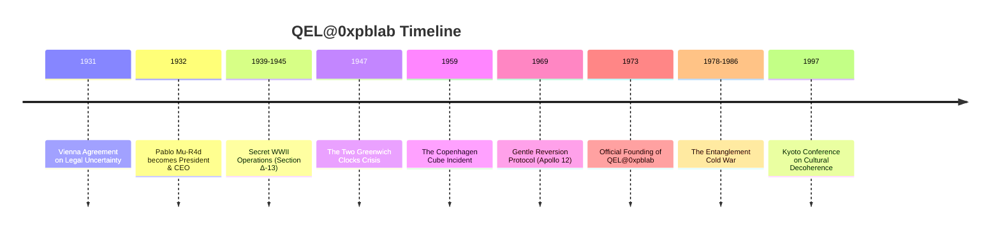

# 🔬 QEL@0xpblab - Quantum Experimental Laboratories

[](https://github.com/0xpbl/.github)
[](https://github.com/0xpbl/.github)
[](https://github.com/0xpbl/.github)
[](https://github.com/0xpbl/.github)
[](https://github.com/0xpbl/.github)

> *“Reality is a distributed system, and observation is a kind of commit.”*
> — The Unsigned Cat Memo, 1973

## 📋 Index

- [About](#-about)
- [History](#-history)
- [Participation in Historical Events](#-participation-in-historical-events)
- [Contributions](#-contributions-to-the-quantum-world)
- [The Prophet ~~Ri~~ck with Fu Monilson](#-the-prophet-rick-with-fu-monilson) 🔮🎸
- [Quantum De-Inclusion™](#-quantum-de-inclusion-the-hr-policy) 🏢
- [The Interdimensional Whiteboard Auditor](#-the-interdimensional-whiteboard-auditor) 🧾🌀
- [John Aunt-Bet](#-john-aunt-bet-the-german-swiss-anti-sugar-operator) 🍬🚫
- [Gaybe-EL](#-gaybe-el-the-mullet-barbed-maestro-of-the-company-orchestra) 🎻🧔🐟
- [Madeusa De La Passion](#-madeusa-de-la-passion-the-companys-winter-only-lawyer) ⚖️🧥
- [Jão Bolão](#-jão-bolão-the-forge-dwarf-everyone-swears-exists-but-hes-normal-sized) ⚒️🧱
- [Marcitus Markitus](#-marcitus-markitus-the-man-who-sees-a-case-in-everything-even-in-slides) 🕵️‍♂️🧷
- [Marcelo Marmelo Martelo](#-marcelo-marmelo-martelo-a-baixada-kid-vs-the-quantum-universe) 🥭🔨
- [Old Ed / Eduardo Fontoura](#-old-ed--eduardo-fontoura-the-man-who-spawns-old) 👴🧭
- [Villains Dossier](#-villains-dossier) 🦹
- [TV Programs](#-tv-programs) 📺
- [GOROSSARIO](#-gorossary) 📚👶
- [Installation](#-installation)
- [How to Use](#-how-to-use)
- [Architecture](#-architecture)
- [Contributing](#-contributing)
- [Team](#-team)
- [Important Notices](#-important-notices)
- [License](#-license)
- [Contact & Addresses](#-contact--addresses)

## 🧾 About {#sobre}

The **Quantum Experimental Laboratories at 0xpblab** (QEL@0xpblab) was officially born in **1973**, in a windowless basement somewhere between physics’ “floor -1” and international bureaucracy’s “floor 256.”

**Officially:** a quantum research lab.
**Unofficially:** a meetup spot for people who believed the Universe wasn’t “weird” — just badly documented.

### 🐈 The First Document

QEL@0xpblab’s first document — the legendary **Unsigned Cat Memo** — stated, with administrative seriousness:

> “Reality is a distributed system, and observation is a kind of commit.”

That sentence was ignored for two decades, until it resurfaced in a “leaked” report (meaning: printed, bound, and hand-delivered) to a scientific committee that couldn’t decide whether to approve the idea or call an electrician.

### 👔 Quantum Leadership

Since **1932**, QEL@0xpblab’s President & CEO has been **[Pablo Mu-R4d](https://github.com/runawaydevil)** — and, in a way that is perfectly consistent with the lab’s quantum accounting, he is only **38 years old**.

The board logs this as a *“benign side effect of a rigorous youth-conservation policy via selective decoherence,”* audited annually by a committee that always arrives **too early and too late at the same time**.

> 👔 **[Read Pablo Mu-R4d’s complete biography →](PABLO-MU-R4D.md)**

## 📚 History

### Timeline



### 🎖️ WWII Operations

Between 1939 and 1945, QEL@0xpblab operated secretly under the codename **Section Δ-13**, an “advanced metrology unit” that never officially existed.

**Mission:** prevent reality from collapsing into the worst possible branch due to a lack of documentation.

**Notable operations:**
- 📜 First Directive: “Do Not Observe Too Much”
- 🗺️ Probabilistic Cartography Protocol
- 📦 Coherence Smuggling
- 📡 The Night the Signal Arrived Early
- 🌉 The Plan-B Bridge Incident

> 🎖️ **[Read the complete war-operations dossier →](WWII-OPERATIONS.md)**

### ❄️🔥 The Warm-ish Hot War (1947–1991)

QEL@0xpblab never called it the “Cold War.” Internally it is logged as the **Warm-ish Hot War**: hot enough to melt trust, warm enough to keep everything “deniable.”

**Critical periods:**
- 🌡️ 1947–1953: Thermal Ice, Political Heat
- 🔬 1954–1961: Prototypes Nobody Was Supposed to See
- ⚠️ 1962: The Year Reality Almost Chose Wrong
- 🔗 1978–1986: The Entanglement Cold War
- 🎯 1983: The “True Enough” Incident
- 🌊 1987–1991: Dissolution via Cultural Decoherence

> ❄️🔥 **[Read the complete Warm-ish Hot War dossier →](COLD-WAR.md)**

## 🌍 Participation in Historical Events

### 1️⃣ "The Vienna Agreement on Legal Uncertainty" (1931) {#acordo-viena}

<details>
<summary>📖 Expand details</summary>

Long before “officially” existing, QEL@0xpblab already appeared as a footnote in correspondence among Important People. In 1931, at a congress in Vienna, a group of jurists attempted to “sue” the Uncertainty Principle for being “deliberately vague.”

**What happened:**
- A QEL@0xpblab representative — identified only as **Dr. K.**, wearing a QR-code badge nobody could scan
- Presented a brilliant defense: uncertainty was not a flaw, it was a feature
- The committee, not understanding, signed the Agreement: the Universe was allowed to clarify nothing, as long as it maintained statistical consistency

> 📁 The text was filed in a drawer labeled “Metaphysics / Accounting.”

</details>

### 2️⃣ The Two Greenwich Clocks Crisis (1947) {#crise-relogios}

<details>
<summary>📖 Expand details</summary>

In 1947, Greenwich Observatory staff recorded an embarrassing phenomenon: two atomic clocks, side by side, disagreed as if they had political opinions. The British press called it **“the time rebellion.”**

**QEL@0xpblab solution:**
1. Put both clocks in a room
2. Ask them to reach consensus by constructive interference
3. After 72 hours, they synchronized

**Side effect:** Greenwich became, technically, in two time zones at once, inaugurating the first **“±UTC”** offset.

> 🇬🇧 The UK government solved this by creating Daylight Saving Time and pretending that was the plan all along.

</details>

### 3️⃣ The "Copenhagen Cube" Incident (1959) {#cubo-copenhagen}

<details>
<summary>📖 Expand details</summary>

In 1959, during a private demo in Denmark, a QEL@0xpblab prototype — the famous **Copenhagen Cube** — was powered on for 11 seconds. The device’s purpose was to “optimize local probabilities” (make the unlikely happen while still looking like statistics).

**Reported occurrences during the 11 seconds:**
- 🎩 A hat disappeared and reappeared somewhere more appropriate
- 💡 A scientist remembered an idea he hadn’t had yet
- 👏 A full audience applauded before the ending, claiming “the ending was already observed”

> ⚠️ The Cube was powered off out of prudence and basic social etiquette. Since then, every lab device ships with a sticker: **“Do not observe during operation.”**

</details>

### 4️⃣ "Gentle Reversion Protocol" during Apollo 12 Landing (1969) {#apollo-12}

<details>
<summary>📖 Expand details</summary>

The public remembers 1969 for landing on the Moon. QEL@0xpblab remembers 1969 because, at one point, Apollo 12’s landing threatened to occur on **two different moons**, one of them slightly hypothetical.

**Official record:** instrument failures and electrical interference.
**Unofficial record:** QEL@0xpblab applied the **Gentle Reversion Protocol**, a technique to “convince” the system to collapse into the safest reality branch.

> 🧾 Internal motto: “If reality bifurcates, pick the branch with better documentation.”

</details>

### 5️⃣ The Entanglement Cold War (1978–1986) {#guerra-emaranhamento}

<details>
<summary>📖 Expand details</summary>

Between 1978 and 1986, QEL@0xpblab participated in the most delicate episode of quantum geopolitics: the **Entanglement Cold War**. Two blocs fought for instantaneous communication supremacy: no signal, no cable, no excuses.

**QEL@0xpblab contribution:**
- Entered as a technical mediator
- Introduced a clause nobody read: every international entangled channel must include a **Minimum Diplomatic Noise** layer
- Objective: prevent absolute messages like “yes” or “no”

> 📧 This likely prevented at least three global crises — and accidentally created the modern corporate tradition of vague email replies.

</details>

### 6️⃣ "Kyoto Conference on Cultural Decoherence" (1997) {#kyoto}

<details>
<summary>📖 Expand details</summary>

In 1997, in Kyoto, the first conference dedicated to a key topic took place: how society “decoheres” strange ideas until they become normal.

**QEL@0xpblab talk:**
- Model of Social Coherence
- Argued that revolutionary concepts require:
  - ✅ Isolation
  - ✅ Thermal control
  - ✅ A committee that doesn’t ask too many questions

> 📊 The talk was so convincing that many attendees swore they understood it — although nobody can reproduce the slides to this day. Rumor says that whenever you try to project them, they collapse into a generic bar chart.

</details>

## 🌟 Contributions to the Quantum World

QEL@0xpblab is considered important for one fundamental reason: it was the first lab to treat reality as **infrastructure**.

Before it, quantum physics was viewed as a set of mysteries. QEL@0xpblab insisted it was a set of **poorly standardized interfaces**.

### 🔑 Key Contributions

| Contribution | Description |
|-------------|------------|
| **Observation Log Theory** | Measuring doesn’t merely reveal; it *records*. And recording changes the system. |
| **Deterministic Collapse Under Pressure Framework** | When reality must deliver on a corporate deadline, it chooses a branch that is “good enough.” |
| **Paradox Normalization** | Paradoxes are bugs only if you promised human consistency. |
| **0xPB Experimental Coherence Standard** | The exact boundary between “science” and “absurd history with technical terms.” |
| **Controlled Amplification Protocol** | Music as structured noise to prevent performative certainty and infinite committees. |
| **Quantum De-Inclusion™** | HR policy keeping employees in superposition of belonging. |
| **Insulin as a Coherence Artifact** | Internal-reality regulator preventing glycemic collapses and extra meetings. |

## 🔮🎸 The Prophet ~~Ri~~ck with Fu Monilson

On a night at 02:38 (±UTC), QEL@0xpblab received a visit that changed its operational approach: **~~Ri~~ck with Fu Monilson**, a prophet who arrived with a hard case and a guitar pick.

### Arrival

The prophet presented the **Controlled Amplification Protocol (v0.38)**, a methodology based on heavy metal (specifically KISS) to counter the lab’s four villains:

- **Verse doesn’t decide** — prevents premature certainty (Laplace)
- **Chorus collapses** — repeatable and auditable structure
- **Solo reveals interference** — exposes hidden issues
- **Bridge is where causality cries** — critical transition moments

### Impact

The protocol complements **Minimum Diplomatic Noise** (from the Warm-ish Hot War dossier) and evolves the First Directive, offering a practical toolset to:

- Prevent performative certainty
- Reduce infinite committees
- Force absolute deadlines
- Cool narratives with “moral heat”

> 🔮🎸 **[Read the full story of the prophet’s arrival →](FU-MONILSON.md)**

## 🏢 Quantum De-Inclusion™: The HR Policy

QEL@0xpblab does not practice classical inclusion. It practices **Quantum De-Inclusion™**: a policy that keeps each employee **included in at least one branch of reality**, and **excluded in all others**.

### Principles

- **Human scalability:** no one finds anyone, reducing friction
- **Emotional latency:** context creates attachment; no context, no expectations
- **Calendar survival:** meetings with chairs in superposition

### Protection against villains

DQ specifically protects against:

- **Dr. Null Quorum:** hard cap of 7 participants per meeting
- **Countess Zeno:** absolute, non-negotiable deadlines
- **Mrs. Laplace:** restrictions on determinism disguised as culture
- **Willy Xarzenegger:** “moral heat” cooldown procedures

> 🏢 **[Read the complete DQ policy →](DQ.md)**

## 🧾🌀 The Interdimensional Whiteboard Auditor

After the prophet’s visit, the Communications Room whiteboard recorded a new presence — a name nobody can pronounce and a stamp that reads: **CONSISTENT ENOUGH**.

The entity is referred to as the **Interdimensional Whiteboard Auditor**, a neutral lead character whose infinite mission is to decipher **π** — not for curiosity, but for fiscal obligation.

> 🧾🌀 **[Read the Auditor file →](QEL-PACOTE-EXTRAS.md)**

## 🍬🚫 John Aunt-Bet: The German-Swiss Anti-Sugar Operator

John Aunt-Bet arrived at QEL@0xpblab not by recruitment, but by **thermodynamic necessity**.

He is capable of refusing dessert in public — which, in any culture, is functionally a weapon.

His insulin is classified as **biological coherence infrastructure**.

> 🍬🚫 **[Read John Aunt-Bet's biography →](JOHN-AUNT-BET.md)**

## 🎻🧔🐟 Gaybe-EL: The Mullet-Barbed Maestro of the Company Orchestra

Gaybe-EL is an executive-musical entity who conducts the **Company Orchestra** — a collection of people who swore they were "just here for spreadsheets," and somehow ended up tuning triangles while arguing about OKRs.

He is not exactly a director. He is a **pattern**.

- When everything becomes chaos, he appears with a baton.
- When everything becomes *too certain*, he appears with an intentionally out-of-tune sax.
- When someone says "let's align," he produces a metronome and makes the needle point directly at **you**.

### The Company Orchestra

The company is governed by an invisible orchestra playing **all the time**, especially when you pretend you can't hear it. Sections:

- **Strings (Product):** always in crescendo, never in definition.
- **Brass (Sales):** loud, unpredictable timing, unshakable confidence.
- **Woodwinds (Engineering):** precise tones, in frequencies only the server understands.
- **Percussion (Finance/Legal):** rare entries, but when they hit, the whole room changes key.
- **Choir (HR):** harmonizes chaos and calls it "culture."

Gaybe-EL conducts. But he conducts like he has a personal vendetta against **4/4 time**.

### Connection to the Amplification Protocol

Gaybe-EL emerged as the **corporate implementation** of the musical philosophy of the [Prophet ~~Ri~~ck with Fu Monilson](FU-MONILSON.md). While the Prophet brought the Controlled Amplification Protocol based on heavy metal, Gaybe-EL transformed it into a corporate orchestra that plays in **7/8** "to keep the team alert."

> 🎻🧔🐟 **[Read the complete Gaybe-EL documentation →](GAYBE-EL.md)**

## ⚖️🧥 Madeusa De La Passion: The Company's Winter-Only Lawyer

Madeusa De La Passion is the company's lawyer **only in winter** (temperature <= 18°C). He doesn't "take time off" in other seasons. He simply **changes professions as casually as other people change scarves**.

### The Seasonal Contract

His contract is the shortest document in the building and somehow the most terrifying:

```
1) TERM: June–August (or any week someone says "it's windy")
2) CONDITION: Temperature <= 18°C (wind chill counts; drama counts double)
3) VENUE: The meeting room with the AC set to "Arctic"
4) COMPENSATION: coffee, silence, and a promise not to schedule calls at 7am
```

When temperatures rise, the contract doesn't "expire."

It **melts**.

### Legal Practice (Cold Weather Only)

In winter, Madeusa is ruthless. He reads contracts like Greek tragedies. His specialties include:

- **Employment law** (activated when someone suggests "working a little later")
- **Contract law** (with clauses that sound like sad poems)
- **Meeting law** (injunctions against agendas with nine useless topics)

### Connections to QEL@0xpblab

Madeusa works closely with [Quantum De-Inclusion™](DQ.md), reviewing contracts that keep collaborators in a superposition of belonging. He has also reviewed the contracts of Gaybe-EL's [Company Orchestra](GAYBE-EL.md), resulting in the famous "Southern Wind Clause" that suspends discussions when the room gets tense.

> ⚖️🧥 **[Read the complete Madeusa documentation →](MADEUSA-DE-LA-PASSION.md)**

## ⚒️🧱 Jão Bolão: The "Forge Dwarf" Everyone Swears Exists (But He's Normal-Sized)

Jão Bolão is QEL@0xpblab's **Equipment Builder**, working in **Forge Δ** — a room that doesn't appear on maps because "maps are certainty, and certainty gets you fined."

### The "Forge Dwarf" Rumor

The rumor started when someone saw Jão crawling out of a 1.2m maintenance hatch he designed himself to keep managers out unless they physically humble themselves (a public health measure). With a thick apron, huge gloves, and constant soot, the vibe is so "fantasy forge" that everyone's brain screams: **"Dwarf smith!"**

But Jão isn't a dwarf. He's normal-sized. The door is just pessimistic.

### Forge Δ

Forge Δ lives in a corridor that doesn't appear on maps. The door has a sign: **"ENTER AT YOUR OWN RISK: THE AIR HERE HAS OPINIONS."**

Inside you'll find three things:
- heat
- metal
- and a silence broken only by *clack—CLACK—clack*, the official language of competence

### What He Builds

Jão doesn't make "gear." He makes **operational artifacts**: things that stop the universe from turning into meetings.

Some examples:
- **"CONSISTENT ENOUGH" stamp (metal edition)** — Hits and leaves a mark even on bad arguments
- **Anti-Superposition Turnstile Patch (v0.2)** — Doesn't solve physics—solves "people trying to walk through"
- **Insulin cold-box for John Aunt-Bet** — Because sugar is a weapon and insulin is infrastructure
- **Pick holster for ~~Ri~~ck com Fu** — With safety lock: "NO SOLOS > 10 MIN IN KPI AREAS"
- **Hammer "BOLÃO-1"** — Not for metal. For "let's align"

### Cast Interactions

- **With Old Ed**: Old Ed trusts Jão because tools don't lie. And Jão is basically a tool with a tax ID.
- **With Marcelo**: Allies against the universe and against milk (cow juice).
- **With John Aunt-Bet**: Built an insulin thermal vault labeled: "DO NOT OPEN WHILE CRAVING SWEETS."
- **With ~~Ri~~ck com Fu**: Forged a guitar that collapses reality in the chorus... but it weighs 80kg, because "a solo should earn itself."
- **With the Chalkboard Auditor**: When the Auditor tried to audit the hammer, Jão said: "π is 3 when I'm in a hurry." Reality spawned a new branch called **"useful blasphemy"**.

> ⚒️🧱 **[Read Jão Bolão's complete story →](JAO-BOLAO.md)**

## 🕵️‍♂️🧷 Marcitus Markitus: The Man Who Sees "A CASE" in Everything (Even in Slides)

Marcitus Markitus is QEL@0xpblab's **Case Analyst** — a self-assigned title that includes romantic cases, criminal cases, and use cases. His special skill: turning PDFs into soap operas, and soap operas into investigations.

### The Forbidden CASE Theory

Marcitus sustains the central thesis of his life:

> **"The Company CEO had an affair with the wife of a drunk, stuttering guy from quantum space."**

He doesn't say "maybe." He says "I know." And when someone asks "how?", he answers: "I have evidence."

The origin of the misunderstanding: he saw in a document the phrase **"new use case in production"** and read **"new CEO case in production"**. Since then, he's been in a state of continuous investigation.

### The Evidence Board

Marcitus set up a board in the Communications Room with:
- red thread (classic)
- post-it notes with "HMMMM"
- CEO photo printed in fax quality
- and the phrase **"CASE?"** written 47 times

The Chalkboard Auditor tried to audit it and wrote "EVIDENCE: INCONCLUSIVE." Marcitus replied: "Inconclusive is what they want you to think." The chalkboard gave up and wrote: **"CONSISTENT ENOUGH."**

### Little Marcitus Markitus

Marcitus has a son: **Little Marcitus Markitus** (also known as "The Tiny Compliance Officer"). He wears a gray suit, sticks close to his father, and communicates 80% of the world with just a fixed stare, minimal smile, and a nod that looks like a silent stamp. He carries a clipboard where he writes "APPROVED" and "NOT APPROVED" without explaining the criteria.

### Cast Interactions

- **With the Chalkboard Auditor**: Tried to audit the evidence board, but gave up after Marcitus's response
- **With Old Ed**: Received a fine for "excessive narrative" when he insisted on using red thread
- **With Pablo Mu-R4d**: Investigates the CEO for a supposed "affair" (which is actually a "use case")
- **With the Communications Room**: Where he set up the board that is "aesthetic terrorism"

### When Gossip Becomes Infrastructure

Over time, QEL realized something: **Marcitus is useful**. He finds inconsistencies because he is a walking inconsistency. Where everyone sees "a meeting," Marcitus sees "a crime." And sometimes... it really is.

> 🕵️‍♂️🧷 **[Read Marcitus Markitus's complete story →](MARCITUS-MARKITUS.md)**

## 🥭🔨 Marcelo Marmelo Martelo: A Baixada Kid vs. the Quantum Universe

At 09:17 (±UTC), after the visit of the [Prophet ~~Ri~~ck with Fu Monilson](FU-MONILSON.md), QEL@0xpblab received a new visitor: **Marcelo Marmelo Martelo**, a Rio kid from Baixada Fluminense who arrived with a plastic bag containing cookies and the stare of someone who's seen "limited time offer" turn into a scam.

### Characteristics

- **Origin**: Baixada Fluminense
- **State**: Rio kid, street-smart, suspicious
- **Role**: Social stabilizer of QEL
- **Specialty**: Translating quantum concepts into Baixada dialect

### The Arrival

The "This Will Go Bad" Detector installed at reception after the last prophet **yelled** (didn't beep) when Marcelo entered. He repeated "dangerous" 11 times in 30 seconds and handed over a document that looked like a bakery receipt with the inscription: "If I vanish, it was the quantum."

### The Anti-Quantum Survival Dictionary

To avoid getting scammed by the universe, Marcelo wrote a dictionary that translates quantum terms into Baixada dialect:

- **Superposition** = "sitting on the fence"
- **Collapse** = "own the mess"
- **Uncertainty** = "life's little trick"
- **Entanglement** = "Wi-Fi gossip"
- **Decoherence** = "lost the plot"

### Confrontation with the Chalkboard Auditor

Marcelo had a direct confrontation with the [Interdimensional Whiteboard Auditor](QEL-PACOTE-EXTRAS.md#-the-interdimensional-whiteboard-auditor), speaking directly to the chalk when the board wrote "AUDIT IN PROGRESS." He offered a Baixada solution: "Round it. Put 3 and move on. Anyone complains, make them prove it."

And said the single most offensive sentence in the quantum universe: **"If π wanted to be exact, it would've ended already."**

### The Role of Social Stabilizer

Marcelo didn't become a scientist. He became what QEL needed most and deserved least: **a social stabilizer**. When someone said "alignment," Marcelo replied: "Alignment is when the train shows up. Everything else is talk."

When [~~Ri~~ck with Fu Monilson](FU-MONILSON.md) arrived with a riff to collapse a branch, Marcelo warned: "Riffs are fine. Collapsing without notice? Not in my universe."

> 🥭🔨 **[Read Marcelo Marmelo Martelo's complete story →](HISTORIA-MARCELO-MARMELO-MARTELO-EN.md)**

## 👴🧭 Old Ed / Eduardo Fontoura: The Man Who Spawns Old

Old Ed (Eduardo Fontoura) is the first documented case of someone hired by QEL@0xpblab **before the lab existed** — a temporal paradox that HR turned into an official position.

### The Temporal Paradox

QEL@0xpblab has an unspoken rule:

> If the universe offers a paradox, HR turns it into a job title.

Old Ed showed up "on day one" already equipped with:
- lower back pain
- strong opinions about everything
- and a pen that only works on paper from 1974

### First Quantumnaut

Old Ed is the first **Quantumnaut** — a quantum traveler and **Quantum Line Police** officer who patrols branches, duct-tapes reality back together, and tickets the universe for misbehavior.

**Why is he always old?** Each jump "teleports" Old Ed's information (not matter), and decoherence makes the universe reconstruct him as "a fully baked old man," because "old" is a stable state. The multiverse trusts old people more than young versions filled with hope.

### First Appearance at QEL@0xpblab

Port gate logs (Door A **or** B) state that the turnstile tried to deny him because the system error was "user has no valid birth date." Old Ed simply held his stamp near the reader, and the reader **apologized**.

Inside, the [Interdimensional Whiteboard Auditor](QEL-PACOTE-EXTRAS.md#-the-interdimensional-whiteboard-auditor) wrote "π = 3." as a test. Old Ed looked and said: "Correct. If you want more digits, run an exam." The Auditor trembled, and reality spawned a new branch called **"respect."**

### Quantum Line Police Protocols

The PATROL Protocol (v0.01) aims to prevent illegal branches from becoming committees ([Dr. Null Quorum](VILLAINS.md#3️⃣-dr-null-quorum-the-paralysis-committee) risk) and stop performative certainty ([Ms. Laplace](VILLAINS.md#4️⃣-mrs-laplace-the-total-determination-curator) risk).

**Old Ed's rules:**
1. If someone says "alignment," issue a ticket.
2. If someone says "just a hypothesis," open an investigation.
3. If reality feels comfortable, assume a crime.
4. If a [prophet](FU-MONILSON.md) appears with an imaginary guitar, let them play (music is structured noise; it works).

### Notable Incidents

- **Incident 41**: Confiscated "predictability" that [Ms. Laplace](VILLAINS.md#4️⃣-mrs-laplace-the-total-determination-curator) tried selling in the hallway.
- **Incident 77**: Put up tape about sugar being a high-risk substance, with [John Aunt‑Bet](JOHN-AUNT-BET.md) and [Marcelo Marmelo Martelo](HISTORIA-MARCELO-MARMELO-MARTELO-EN.md) signing underneath.

> 👴🧭 **[Read Old Ed / Eduardo Fontoura's complete story →](PERSONAGEM-OLD-ED-EDUARDO-FONTOURA-EN.md)**

## 🦹 Villains Dossier

QEL@0xpblab’s main antagonists are the four forces that push reality toward classical failure modes:

- Willy Xarzenegger (moral heat)
- Countess Zeno von Retardo (asymptotic delay)
- Dr. Null Quorum (consensual emptiness)
- Mrs. Laplace (total determination)

> 🦹 **[Read the complete villains dossier →](VILLAINS.md)**

## 📺 TV Programs

QEL@0xpblab insists it does not produce “TV.” It produces “mass communication experiments.”

The audience, as usual, disagrees.

> 📺 **[Read the QEL TV programs catalog →](TV-PROGRAMS.md)**

## 📚👶 GOROSSARIO

The **GOROSSARIO** is a serious document written by **João Darcquinho de Souza** that documents the terms of the QEL@0xpblab universe.

### The Author

**João Darcquinho de Souza** is the author responsible for compiling and documenting the terms used at QEL@0xpblab. His work represents an important contribution to understanding the concepts and characters of the laboratory.

### Content

The glossary includes:
- Definitions of key QEL terms (QEL@0xpblab, DQ, superposition, collapse, decoherence, etc.)
- Main characters (Auditor, Prophet, John, Marcelo, Old Ed, villains)
- Practical survival rules
- Explanations of complex quantum concepts

### Relationship with Other Documents

The GOROSSARIO complements the "Anti-Quantum Survival Dictionary" created by [Marcelo Marmelo Martelo](HISTORIA-MARCELO-MARMELO-MARTELO-EN.md), offering an additional documentary perspective on the same concepts.

> 📚👶 **[Read the complete GOROSSARIO →](GOROSSARIO-EN.md)**

## 💾 Installation

This repository is documentation-first. The recommended setup is to read it in a mildly dim environment and avoid “observing too much.”

```bash
# Clone the repository

git clone https://github.com/0xpbl/qel
cd qel

# Optional: run a consistency check
# (Warning: may collapse your reading list into a single tab.)
```

## 🧪 How to Use

- Start with **qel.md** (this file)
- Follow links to dossiers and protocols
- Do not ask “how” in audit contexts
- If a section feels too certain, add noise (preferably structured)

## 🏗️ Architecture

QEL@0xpblab’s architecture is documentation-driven:

- **Reality layer:** distributed system with eventual consistency
- **Observation layer:** commits and logs
- **Noise layer:** minimum diplomatic noise for stability
- **HR layer:** quantum de-inclusion to prevent committee singularities

## 🤝 Contributing

Contributions are accepted in superposition.

- If you submit a PR, it may be merged in at least one branch.
- Please include logs, stamps, and reproducible ambiguity.

## 👥 Team

- **President & CEO:** Pablo Mu-R4d (38 years old since 1932)
- **Compliance:** permanently offended
- **Whiteboard:** autonomous

## ⚠️ Important Notices

- If you observe too much, reality may behave.
- If you document too little, reality may improvise.
- “Consistent enough” is not “safe.” It’s “auditable.”

## 📄 License

This repository is licensed under **Legal Uncertainty**.

## 📞 Contact & Addresses

```text
QEL@0xpblab — Quantum Experimental Laboratories
Basement Level: -1 (Physics) / 256 (Bureaucracy)
Timezone: ±UTC
Whiteboard: do not erase without cosmic authorization
```
