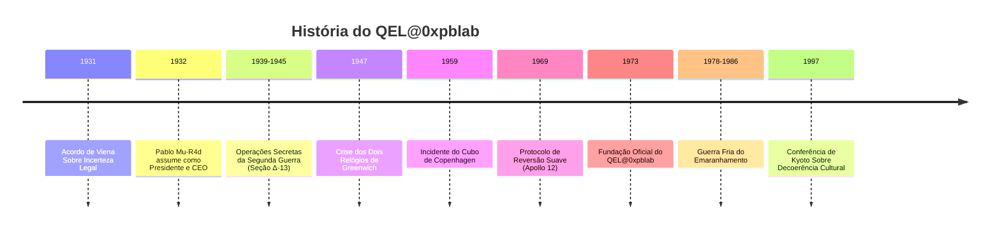
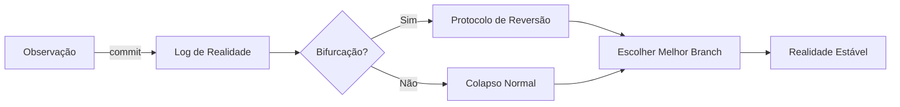

# 🔬 QEL@0xpblab - Quantum Experimental Laboratories

[](https://github.com/0xpbl/.github)
[](https://github.com/0xpbl/.github)
[](https://github.com/0xpbl/.github)
[](https://github.com/0xpbl/.github)
[](https://github.com/0xpbl/.github)

> *"A realidade é um sistema distribuído, e observação é uma forma de commit."*  
> — Memorando do Gato Não-Assinado, 1973

## � Índice

- [Sobre](#-sobre)
- [História](#-história)
- [Eventos Históricos](#-participação-em-eventos-históricos)
- [Contribuições](#-contribuições-para-o-mundo-quântico)
- [O Profeta ~~Ri~~ck com Fu Monilson](#-o-profeta-rick-com-fu-monilson) 🔮🎸
- [Desinclusão Quântica™](#-desinclusão-quântica-a-política-de-rh) 🏢
- [O Fiscal Interdimensional da Lousa](#-o-fiscal-interdimensional-da-lousa) 🧾🌀
- [John Aunt-Bet](#-john-aunt-bet-o-germano-suíço-anti-açúcar) 🍬🚫
- [Dossiê de Vilões](#-dossiê-de-vilões) 🦹
- [Programas de TV](#-programas-de-tv) 📺
- [Instalação](#-instalação)
- [Como Usar](#-como-usar)
- [Arquitetura](#-arquitetura)
- [Contribuindo](#-contribuindo)
- [Equipe](#-equipe)
- [Avisos](#-avisos-importantes)
- [Licença](#-licença)
- [Contato e Endereços](#-contato)

## � Sobre

The **Quantum Experimental Laboratories at 0xpblab** (QEL@0xpblab) nasceu oficialmente em **1973**, num porão sem janelas em algum lugar entre o "andar -1" da física e o "andar 256" da burocracia internacional. 

**Oficialmente:** Um laboratório de pesquisa quântica.  
**Extraoficialmente:** Um ponto de encontro de gente que acreditava que o Universo não era "estranho", e sim apenas mal documentado.

### � O Primeiro Documento

O primeiro documento do QEL@0xpblab — o famoso **Memorando do Gato Não-Assinado** — afirmava, com seriedade administrativa, que:

> "A realidade é um sistema distribuído, e observação é uma forma de commit."

A frase seria ignorada por duas décadas, até aparecer em um relatório "vazado" (na verdade, encadernado e entregue em mãos) para um comitê científico que não sabia se aprovava a ideia ou chamava um eletricista.

### � Liderança Quântica

Desde **1932**, o presidente e CEO do QEL@0xpblab é **[Pablo Mu-R4d](https://github.com/runawaydevil)** — e, de forma perfeitamente consistente com a contabilidade quântica do laboratório, ele tem apenas **38 anos**. 

A diretoria registra isso como *"efeito colateral benigno de uma política rigorosa de conservação de juventude por decoerência seletiva"*, auditada anualmente por uma comissão que sempre chega cedo demais e tarde demais ao mesmo tempo.

> 👔 **[Leia a biografia completa de Pablo Mu-R4d →](PABLO-MU-R4D.md)**

## 📚 História

### Linha do Tempo



### 🎖️ Operações da Segunda Guerra Mundial

Entre 1939 e 1945, o QEL@0xpblab operou secretamente sob o codinome **Seção Δ-13**, uma "unidade de metrologia avançada" que nunca existiu oficialmente.

**Missão:** Evitar que a realidade colapsasse no pior ramo possível por falta de documentação.

**Operações notáveis:**
- 📜 Primeira Diretiva: "Não Observem Demais"
- 🗺️ Protocolo de Cartografia Probabilística
- 📦 Contrabando de Coerência
- 📡 A Noite do Sinal que Chegou Antes
- 🌉 O Incidente da Ponte do Plano B

> 🎖️ **[Leia o dossiê completo das operações de guerra →](WWII-OPERATIONS.md)**

### ❄️🔥 A Guerra Quente-Morna (1947-1991)

O QEL@0xpblab nunca chamou de "Guerra Fria". Para o laboratório, foi a **Guerra Quente-Morna**: quente o suficiente para derreter confiança, morna o suficiente para manter tudo "negável".

**Períodos críticos:**
- 🌡️ 1947-1953: Gelo Térmico e Calor Político
- 🔬 1954-1961: Protótipos que Ninguém Devia Ver
- ⚠️ 1962: O Ano em que a Realidade Quase Escolheu Mal
- 🔗 1978-1986: Guerra Fria do Emaranhamento
- 🎯 1983: Incidente "Verdadeiro o Suficiente"
- 🌊 1987-1991: Dissolução por Decoerência Cultural

> ❄️🔥 **[Leia o dossiê completo da Guerra Quente-Morna →](COLD-WAR.md)**

## � Participação em Eventos Históricos

### 1️⃣ O "Acordo de Viena Sobre Incerteza Legal" (1931)

<details>
<summary>📖 Expandir detalhes</summary>

Muito antes de existir "oficialmente", o QEL@0xpblab já aparecia como nota de rodapé em correspondências de gente importante. Em 1931, durante um congresso em Viena, um grupo de juristas tentou "processar" o Princípio da Incerteza por ser "deliberadamente vago".

**O que aconteceu:**
- Um representante do QEL@0xpblab — identificado apenas como **Dr. K.**, usando um crachá com QR code que ninguém conseguia escanear
- Apresentou uma defesa brilhante: **a incerteza não era falha, era feature**
- O comitê, sem entender, assinou o Acordo: ficava permitido ao Universo não esclarecer nada, desde que mantivesse consistência estatística

> 📁 O texto foi arquivado numa gaveta rotulada "Metafísica / Contabilidade".

</details>

### 2️⃣ A Crise dos Dois Relógios de Greenwich (1947)

<details>
<summary>📖 Expandir detalhes</summary>

Em 1947, funcionários do Observatório de Greenwich registraram um fenômeno embaraçoso: dois relógios atômicos, lado a lado, discordavam como se tivessem opiniões políticas. A imprensa britânica chamou de **"a rebelião do tempo"**.

**Solução do QEL@0xpblab:**
1. Colocar os relógios numa sala
2. Pedir que chegassem a um consenso por interferência construtiva
3. Após 72 horas, os relógios sincronizaram

**Efeito colateral:** Greenwich passou a estar, tecnicamente, em dois horários ao mesmo tempo, inaugurando o primeiro fuso **"±UTC"**. 

> 🇬🇧 O governo britânico resolveu o assunto criando o Horário de Verão e fingindo que era isso desde o começo.

</details>

### 3️⃣ O Incidente do "Cubo de Copenhagen" (1959)

<details>
<summary>📖 Expandir detalhes</summary>

Em 1959, durante uma demonstração privada na Dinamarca, um protótipo do QEL@0xpblab — o famoso **Cubo de Copenhagen** — foi ligado por 11 segundos. O aparelho tinha a finalidade de "otimizar probabilidades locais" (fazer o improvável acontecer com cara de estatística).

**Ocorrências relatadas durante os 11 segundos:**
- 🎩 Um chapéu desapareceu e reapareceu em um lugar mais apropriado
- 💡 Um cientista lembrou uma ideia que ainda não tinha
- 👏 Uma audiência inteira aplaudiu antes do final, alegando que "o final já estava observado"

> ⚠️ O Cubo foi desligado por prudência e por etiqueta social. Desde então, todo equipamento do laboratório vem com um adesivo: **"Não observar durante operação."**

</details>

### 4️⃣ O "Protocolo de Reversão Suave" no Pouso da Apollo 12 (1969)

<details>
<summary>📖 Expandir detalhes</summary>

O público lembra de 1969 pela chegada à Lua. O QEL@0xpblab lembra de 1969 pelo fato de que, em certo momento, o pouso da Apollo 12 ameaçou ocorrer em **duas luas diferentes**, uma delas levemente hipotética.

**Registros oficiais:** Falhas de instrumento e interferências elétricas.  
**Registros extraoficiais:** A equipe do QEL@0xpblab aplicou o **Protocolo de Reversão Suave**, uma técnica de "convencer" o sistema a colapsar no ramo mais seguro da realidade.

> � **Lema interno:** "Se a realidade bifurcar, escolha o ramo com melhor documentação."

</details>

### 5️⃣ A Guerra Fria do Emaranhamento (1978–1986)

<details>
<summary>📖 Expandir detalhes</summary>

Entre 1978 e 1986, o QEL@0xpblab participou do episódio mais delicado da geopolítica quântica: a **Guerra Fria do Emaranhamento**. Dois blocos disputavam a supremacia de comunicação instantânea, sem sinal, sem cabo, sem desculpas.

**Contribuição do QEL@0xpblab:**
- Entrou como mediador técnico
- Introduziu uma cláusula que ninguém leu: qualquer canal emaranhado internacional deveria incluir um **"ruído diplomático mínimo"**
- Objetivo: impedir mensagens absolutas como "sim" ou "não"

> 📧 Isso teria evitado pelo menos três crises globais e criado, sem querer, a tradição moderna de respostas vagas em e-mails corporativos.

</details>

### 6️⃣ A "Conferência de Kyoto Sobre Decoerência Cultural" (1997)

<details>
<summary>📖 Expandir detalhes</summary>

Em 1997, em Kyoto, aconteceu a primeira conferência dedicada a um tema essencial: como a sociedade "decoere" ideias estranhas até virarem normalidade.

**Apresentação do QEL@0xpblab:**
- Modelo de Coerência Social
- Argumentou que conceitos revolucionários precisam de:
  - ✅ Isolamento
  - ✅ Controle térmico
  - ✅ Um comitê que não faça muitas perguntas

> 📊 A apresentação foi tão convincente que vários participantes juraram ter entendido — embora ninguém consiga reproduzir os slides até hoje. Dizem que, quando você tenta projetá-los, eles colapsam num gráfico de barras genérico.

</details>

## 🌟 Contribuições para o Mundo Quântico

O QEL@0xpblab é considerado importante por uma razão fundamental: **foi o primeiro laboratório a tratar a realidade como infraestrutura**.

Antes dele, a física quântica era vista como um conjunto de mistérios. O QEL@0xpblab insistiu que era, na verdade, um conjunto de **interfaces mal padronizadas**.

### 🔑 Principais Contribuições

| Contribuição | Descrição |
|-------------|-----------|
| **Teoria do Log de Observação** | Medir não revela; registra. E registro altera o sistema. |
| **Framework de Colapso Determinístico Sob Pressão** | Quando a realidade precisa entregar um resultado em prazo corporativo, ela escolhe um ramo "bom o suficiente". |
| **Normalização de Paradoxos** | Paradoxos são bugs apenas se você prometer consistência humana. |
| **Padrão 0xPB de Coerência Experimental** | Define o limite exato entre "ciência" e "história absurda com termos técnicos". |
| **Protocolo de Amplificação Controlada** | Música como ruído estruturado para evitar certezas performáticas e comitês infinitos. |
| **Desinclusão Quântica™** | Política de RH que mantém colaboradores em superposição de pertencimento. |
| **Insulina como Artefato de Coerência** | Regulador de realidade interna que previne colapsos glicêmicos e reuniões extras. |

## 🔮🎸 O Profeta ~~Ri~~ck com Fu Monilson

Em uma noite de 02:38 (horário ±UTC), o QEL@0xpblab recebeu uma visita que mudaria sua abordagem operacional: **~~Ri~~ck com Fu Monilson**, um profeta que chegou com um case rígido e uma palheta.

### A Chegada

O profeta apresentou o **Protocolo de Amplificação Controlada (v0.38)**, uma metodologia baseada em música heavy metal (especificamente KISS) para combater os quatro vilões do laboratório:

- **Verso não decide** — evita certezas prematuras (Laplace)
- **Refrão colapsa** — estrutura repetível e auditável
- **Solo revela interferência** — expõe problemas ocultos
- **Bridge é onde a causalidade chora** — momentos de transição crítica

### Impacto

O protocolo complementa o [Ruído Diplomático Mínimo](COLD-WAR.md#5️⃣-1978-1986-a-guerra-fria-do-emaranhamento) e evolui a [Primeira Diretiva](WWII-OPERATIONS.md#1️⃣-1939-a-primeira-diretiva--não-observem-demais), oferecendo uma ferramenta prática para:

- Impedir certezas performáticas
- Reduzir comitês infinitos
- Forçar deadlines absolutos
- Resfriar narrativas com "calor moral"

> 🔮🎸 **[Leia a história completa da chegada do profeta →](FU-MONILSON.md)**

## 🏢 Desinclusão Quântica™: A Política de RH

O QEL@0xpblab não pratica inclusão clássica. Pratica **Desinclusão Quântica™**: uma política que mantém cada colaborador **incluído em pelo menos um ramo da realidade**, e **excluído em todos os outros**.

### Princípios

- **Escalabilidade humana**: Ninguém encontra ninguém, reduzindo atrito
- **Latência emocional**: Contexto gera apego; sem contexto, sem expectativas
- **Sobrevivência do calendário**: Reuniões com cadeiras em superposição

### Proteção Contra Vilões

A DQ protege especificamente contra:

- **Dr. Null Quorum**: Limite de 7 participantes por reunião
- **Condessa Zeno**: Deadlines absolutos e não-negociáveis
- **Sra. Laplace**: Evita determinismo social
- **Willy Xarzenegger**: Reduz "calor moral" corporativo

> 🏢 **[Leia a documentação completa da Desinclusão Quântica™ →](DQ.md)**

## 🧾🌀 O Fiscal Interdimensional da Lousa

Após a visita do profeta ~~Ri~~ck com Fu Monilson, uma nova entidade apareceu na [Sala de Comunicações](FU-MONILSON.md#-sala-de-comunicações): o **Fiscal Interdimensional da Lousa**, uma entidade com nome impronunciável (registrado como **ϟˣ̸̷̴⟂⧉⟁⟟⟟⟟⟂∿**) que fiscaliza a coerência da realidade.

### Características

- **Neutro por definição**: Não toma partido, nem quando o universo pede ajuda
- **Missão infinita**: Tentar decifrar o número π (que nunca fecha)
- **Poder especial**: Auditoria de coerência interdimensional
- **Limitação**: Cagueira nítida que impede pronunciar π completamente

### Primeira Aparição

O Fiscal apareceu pela primeira vez na lousa da Sala de Comunicações, deixando a inscrição:

```
π = 3.
CONSISTENTE O SUFICIENTE.
```

> 📦 **[Leia a história completa do Fiscal Interdimensional da Lousa →](QEL-PACOTE-EXTRAS.md#-o-fiscal-interdimensional-da-lousa)**

## 🍬🚫 John Aunt-Bet: O Germano-Suíço Anti-Açúcar

John Aunt-Bet chegou ao QEL@0xpblab por **necessidade termodinâmica**, não por recrutamento. Primeira menção aparece em um memorando da [Seção Δ-13](WWII-OPERATIONS.md#-codinome-seção-δ-13), onde foi descrito como alguém capaz de "dizer 'não' para coisas bonitas".

### Características

- **Alergia cultural a doces**: Bioquímica, existencial e narrativa
- **Insulina como artefato**: Classificada como item de infraestrutura crítica
- **Proteção especial**: Único capaz de resistir a "docinhos de certeza" da [Sra. Laplace](VILLAINS.md#4️⃣-a-sra-laplace-a-curadora-da-determinação-total)
- **Primeira aparição**: No refeitório, onde encontrou [~~Ri~~ck com Fu Monilson](FU-MONILSON.md)

### Protocolos

- **ANTI-DOCE (v1.0)**: "Não encostar no ramo açucarado"
- **INSULINA (v2.7)**: "Coerência interna"
- **BISCOITO (v0.1)**: "Contenção preventiva"

> 🍬🚫 **[Leia a biografia completa de John Aunt-Bet →](JOHN-AUNT-BET.md)**

## 🎻🧔🐟 Gaybe-EL: O Barbo dos Mullets, Regente da Orquestra da Companhia

Gaybe-EL é uma entidade executivo-musical que rege a **Orquestra da Companhia** — um conjunto de pessoas que juraram que só iam "trabalhar com planilhas" e, de repente, estão afinando triângulos enquanto discutem OKRs.

Ele não é exatamente um diretor. Ele é um **padrão**.

- Quando tudo vira caos, ele aparece com uma batuta.
- Quando tudo vira certeza demais, ele aparece com um saxofone desafinado.
- Quando alguém diz "vamos alinhar", ele aparece com um *metrônomo* e faz o ponteiro apontar pra você, pessoalmente.

### A Orquestra da Companhia

A companhia é governada por uma orquestra invisível que toca **o tempo todo**, principalmente quando você finge que não está ouvindo. Seus naipes são:

- **Cordas (Produto)**: sempre em crescendo, nunca em definição.
- **Metais (Vendas)**: volume alto, timing imprevisível, confiança inabalável.
- **Madeiras (Engenharia)**: sons precisos, mas em frequências que só o servidor entende.
- **Percussão (Financeiro/Legal)**: entra raro, mas quando entra, todo mundo muda de tom.
- **Coral (RH)**: harmoniza o caos e chama de "cultura".

Gaybe-EL é o regente. Mas ele rege como quem tem **ódio pessoal de compasso 4/4**.

### Conexão com o Protocolo de Amplificação

Gaybe-EL surgiu como a **implementação corporativa** da filosofia musical do [Profeta ~~Ri~~ck com Fu Monilson](FU-MONILSON.md). Enquanto o Profeta trouxe o Protocolo de Amplificação Controlada baseado em heavy metal, Gaybe-EL transformou isso em uma orquestra corporativa que toca em **7/8** "pra manter a equipe alerta".

> 🎻🧔🐟 **[Leia a documentação completa de Gaybe-EL →](GAYBE-EL.md)**

## ⚖️🧥 Madeusa De La Passion: O Advogado de Inverno da Companhia

Madeusa De La Passion é o advogado da companhia **somente no inverno** (temperatura <= 18°C). Ele não "se ausenta" nas outras estações: ele simplesmente **muda de profissão com a naturalidade de quem troca de cachecol**.

### O Contrato Sazonal

O contrato dele é o mais curto do mundo e o mais assustador do escritório:

```
1) VIGÊNCIA: Junho a Agosto (ou qualquer semana em que alguém diga "tá ventando")
2) CONDIÇÃO: Temperatura <= 18°C (sensação térmica conta, drama conta em dobro)
3) FORO: Sala de reuniões com ar-condicionado no talo
4) REMUNERAÇÃO: café, silêncio e a promessa de não marcar call às 7h
```

Quando a temperatura sobe, o contrato não "expira". Ele **derrete**.

### Prática Jurídica (Só no Frio)

No inverno, Madeusa é implacável. Ele lê contratos como quem lê tragédias gregas. Suas especialidades incluem:

- **Direito do Trabalho** (só quando a equipe quer "trabalhar até mais tarde")
- **Direito Contratual** (com cláusulas que parecem poemas depressivos)
- **Direito de Reunião** (impugnação de agendas com 9 tópicos inúteis)

### Conexões com QEL@0xpblab

Madeusa trabalha em estreita colaboração com a [Desinclusão Quântica™](DQ.md), revisando contratos que mantêm colaboradores em superposição de pertencimento. Ele também já revisou os contratos da [Orquestra da Companhia](GAYBE-EL.md) de Gaybe-EL, resultando na famosa "Cláusula do Vento Sul" que suspende discussões quando o ambiente fica tenso.

> ⚖️🧥 **[Leia a documentação completa de Madeusa →](MADEUSA-DE-LA-PASSION.md)**

## 🦹 Dossiê de Vilões

O QEL@0xpblab enfrenta ameaças únicas: adversários que não destroem a ciência, mas a tornam **tecnicamente correta e fundamentalmente inútil**.

### O Quarteto da Impossibilidade

Conheça os quatro principais antagonistas do laboratório:

| Vilão | Especialidade | Nível de Ameaça |
|-------|---------------|-----------------|
| 🔥 **Willy Xarzenegger** | Entropia aplicada e sabotagem térmica | ⚠️⚠️⚠️⚠️⚠️ |
| ⏳ **Condessa Zeno von Retardo** | Atrasos assintóticos e burocracia infinita | ⚠️⚠️⚠️⚠️⚠️ |
| 📋 **Dr. Null Quorum** | Governança paralisante e consenso impossível | ⚠️⚠️⚠️⚠️⚠️ |
| 📊 **Sra. Laplace** | Determinismo agressivo e negação da incerteza | ⚠️⚠️⚠️⚠️⚠️ |

**Efeito combinado:** Um mundo onde experimentos "funcionam, mas não sabemos quando, por quem, nem se era para funcionar".

> 📖 **[Leia o dossiê completo de ameaças →](VILLAINS.md)**

## 📺 Programas de TV

O QEL@0xpblab insiste que não produz televisão — produz **"experimentos de comunicação em massa"**. O público discorda.

### 🎬 Programas Originais

| Programa | Formato | Destaque |
|----------|---------|----------|
| 📺 **Schrödinger's Reality Show** | Reality | Participantes eliminados E vencedores ao mesmo tempo |
| 📰 **Jornal do Amanhã Ontem** | Telejornal | Notícias com 24h de antecedência, corrigidas por rodapé |
| 👨‍🍳 **MasterChef Baixa Entropia** | Culinária | "Seu risoto está muito provável" |
| 🐓 **A Fazenda de Copenhagen** | Reality Rural | Animais como "tendência estatística" |
| 👨‍👩‍👧 **Casos de Família em Superposição** | Talk Show | Duas versões do conflito em paralelo |
| 🔍 **CSI: Decoerência** | Investigação | Zoom sempre revela gráfico de barras |

### 🎥 Programas Reais "Adotados"

O laboratório "assina" obras reais consideradas ruins como prova de **"decoerência cultural mensurável"**:

- **The Room** - "Documentário involuntário sobre causalidade falha"
- **Cats** - "Experimento de vale da estranheza em escala industrial"
- **Sharknado** - "Quando a improbabilidade vira modelo de negócios"
- **Velocipastor** - "Prova de que orçamento não colapsa coerência"

> 📺 **[Veja o catálogo completo de programas →](TV-PROGRAMS.md)**

## 🚀 Instalação

```bash
# Clone o repositório (se ele existir na sua linha temporal)
git clone https://github.com/0xpblab/qel.git

# Entre no diretório
cd qel

# Instale as dependências quânticas
npm install --save-dev @qel/uncertainty-principle
npm install --save-dev @qel/superposition-state

# Configure o ambiente
export REALITY_MODE=distributed
export OBSERVATION_LEVEL=commit

# Execute o setup
./setup.sh --with-decoherence-protection
```

> ⚠️ **ATENÇÃO:** Se durante a instalação você observar um gato que está simultaneamente vivo e morto, está tudo funcionando perfeitamente.

## 📖 Como Usar

### Exemplo Básico

```javascript
const QEL = require('@qel/quantum-core');

// Inicialize o laboratório
const lab = new QEL.Laboratory({
  location: 'andar -1',
  windows: false,
  bureaucracy: 256
});

// Crie uma observação
lab.observe({
  target: 'realidade',
  method: 'commit',
  expectation: 'consistência estatística'
})
.then(resultado => {
  console.log('Observação registrada:', resultado.branch);
})
.catch(erro => {
  console.error('A realidade bifurcou:', erro.dimensions);
});
```

### Protocolo de Reversão Suave

```javascript
const { ReversaoSuave } = require('@qel/protocols');

// Quando a realidade bifurcar
ReversaoSuave.aplicar({
  criterio: 'melhor documentação',
  fallback: 'ramo mais seguro'
});
```

### Otimização de Probabilidades

```javascript
const { CuboCopenhagen } = require('@qel/devices');

// CUIDADO: Não observar durante operação
const cubo = new CuboCopenhagen();

cubo.ligar({ duracao: '11 segundos' });
// Aguarde eventos improváveis acontecerem
cubo.desligar({ motivo: 'etiqueta social' });
```

## 🎨 Arquitetura

```
┌─────────────────────────────────────────────────────┐
│  Camada de Interface Humana                         │
│  (Tradução de Conceitos Quânticos para Burocracia)  │
├─────────────────────────────────────────────────────┤
│  Motor de Colapso Determinístico                    │
│  (Framework de Decisão Sob Pressão)                 │
├─────────────────────────────────────────────────────┤
│  Sistema de Log de Observação                       │
│  (Registro Altera o Sistema)                        │
├─────────────────────────────────────────────────────┤
│  Processador de Emaranhamento                       │
│  (Com Ruído Diplomático Mínimo)                     │
├─────────────────────────────────────────────────────┤
│  Núcleo de Superposição                             │
│  (Realidade como Sistema Distribuído)               │
└─────────────────────────────────────────────────────┘
```

### Fluxo de Dados



## 🤝 Contribuindo

Contribuições são bem-vindas! Especialmente se você:

- ✅ Tem experiência com sistemas distribuídos de realidade
- ✅ Sabe lidar com paradoxos sem entrar em pânico
- ✅ Consegue documentar o indocumentável
- ✅ Já participou de pelo menos um evento que tecnicamente não aconteceu
- ✅ Entende que "feature" e "bug" são questão de perspectiva

### 📝 Processo de Contribuição

1. **Fork** o projeto para uma linha temporal alternativa
2. **Crie uma branch** com nome descritivo
   ```bash
   git checkout -b feature/protocolo-reversao-temporal
   ```
3. **Commit** suas mudanças (lembre-se: observação é commit)
   ```bash
   git commit -m "Adiciona suporte para decoerência cultural"
   ```
4. **Push** para a branch
   ```bash
   git push origin feature/protocolo-reversao-temporal
   ```
5. **Abra um Pull Request** interdimensional
6. Aguarde revisão do **Comitê de Coerência Experimental**

### 🐛 Reportando Bugs (ou Features?)

Ao reportar um bug, considere:
- É realmente um bug ou apenas uma realidade alternativa?
- O comportamento é inconsistente ou apenas não-determinístico?
- Você consegue reproduzir em outras linhas temporais?

Use o template:
```markdown
**Descrição:** O que aconteceu vs. o que deveria acontecer
**Passos para Reproduzir:** (se reproduzível)
**Ramo da Realidade:** Qual versão da realidade você estava usando?
**Logs:** Anexe logs de observação
```

## 👥 Equipe

### Liderança Atual
- **[Pablo Mu-R4d](https://github.com/runawaydevil)** - Presidente e CEO (desde 1932, com 38 anos)
  - *Especialidade:* Conservação de juventude por decoerência seletiva

### Fundadores (1973)
- **Dr. K.** - Diretor Fundador (crachá com QR code não-escaneável)
- **Comitê Anônimo** - Membros que juraram ter existido
- **O Gato** - Consultor de Superposição

### Colaboradores Históricos
- Juristas de Viena (1931)
- Funcionários de Greenwich (1947)
- Equipe da Apollo 12 (1969)
- Mediadores da Guerra Fria (1978-1986)
- Participantes de Kyoto (1997)

### Agradecimentos Especiais
- 🙏 Ao Princípio da Incerteza, por ser uma feature
- 🙏 Aos relógios de Greenwich, por chegarem a um consenso
- 🙏 Ao Cubo de Copenhagen, por respeitar a etiqueta social
- 🙏 À Apollo 12, por escolher o ramo com melhor documentação
- 🙏 Aos e-mails corporativos vagos, por manterem a paz mundial

## ⚠️ Avisos Importantes

> 🚪 **Placa na Entrada:**  
> "Não bata. A porta pode estar em superposição."

### ⚡ Precauções de Segurança

- ❌ Não observar equipamentos durante operação
- ❌ Não prometer consistência humana
- ❌ Não tentar reproduzir os slides de Kyoto
- ❌ Não processar o Princípio da Incerteza
- ❌ Não sincronizar relógios manualmente em Greenwich
- ⚠️ Reportar imediatamente qualquer atividade suspeita do [Quarteto da Impossibilidade](VILLAINS.md)

### 🔬 Efeitos Colaterais Conhecidos

- Confusão existencial temporária
- Tendência a ver a realidade como infraestrutura
- Vontade inexplicável de arquivar coisas em "Metafísica / Contabilidade"
- Respostas vagas em e-mails (irreversível)
- Aplaudir antes do final de apresentações

### 📊 Compatibilidade

| Sistema | Status | Notas |
|---------|--------|-------|
| Realidade Única | ⚠️ Limitado | Funciona melhor com múltiplas realidades |
| Causalidade Linear | ✅ Suportado | Com ressalvas temporais |
| Lógica Booleana | ❌ Não recomendado | Use lógica quântica |
| Documentação Completa | 🔄 Em progresso | Eternamente |

## 📜 Licença

Este projeto está licenciado sob a **Licença de Incerteza Legal** (Vienna Agreement, 1931).

**Termos principais:**
- ✅ Permitido não esclarecer nada
- ✅ Deve manter consistência estatística
- ✅ Paradoxos são features, não bugs
- ✅ Observação implica em commit

Veja o arquivo [LICENSE.md](LICENSE.md) para mais detalhes (se ele colapsar na sua linha temporal).

## 📞 Contato

### 🏢 Endereços e Unidades

#### 1️⃣ Sede Oficial

**The Quantum Experimental Laboratories at 0xpblab (QEL@0xpblab)**
```
Avenida da Superposição, 256º Andar
(entre o -1 e o 256), Bloco Ψ
Distrito Administrativo de Burocracia Internacional
CEP: 0xPB-1973
```
📍 **Referência:** *"Entrada pela porta que às vezes é a da frente."*

---

#### 2️⃣ Anexo Técnico de Medições Delicadas

**QEL@0xpblab — Unidade de Coerência e Baixo Ruído**
```
Rua do Observador, Nº 1/2 (conforme medição)
Sala 0
Zona de Interferência Construtiva, Setor Δt
CEP: 00000-±UTC
```
📍 **Referência:** *"Ao lado do relógio que discorda."*

---

#### 3️⃣ Arquivo Central e Contabilidade Metafísica

**QEL@0xpblab — Arquivos 'Metafísica / Contabilidade'**
```
Travessa do Colapso, Lote ∞
Prateleira "Quase"
Cartório de Realidades Alternativas, Subsolo 3 (ou 4)
CEP: 1931-UNC
```
📍 **Referência:** *"Peça pelo Memorando do Gato Não-Assinado; entregue sem observar."*

---

#### 4️⃣ Campus Copenhagen (Protótipos e Probabilidades)

**QEL@0xpblab — Copenhagen Probabilistic Yard**
```
Praça do Cubo, 11 segundos a pé do centro
Pavilhão CPH-ψ
Dinamarca (ou ramo adjacente)
Caixa Postal: "Improvável, porém estatístico"
CEP: 1959-CUB
```
📍 **Referência:** *"Se você achar um chapéu, não devolva. Ele já escolheu um lugar melhor."*

---

#### 5️⃣ Unidade de Relações Geopolíticas do Emaranhamento

**QEL@0xpblab — Entanglement Diplomacy Office**
```
Boulevard do Ruído Diplomático Mínimo
Sala 'Sim/Não (não permitido)'
Setor de Comunicações Sem Cabo, Quarteirão EPR
CEP: 1978-1986
```
📍 **Referência:** *"Responder e-mails apenas com 'talvez'."*

---

#### 6️⃣ Escritório do Presidente e CEO

**Presidência & CEO — [Pablo Mu-R4d](https://github.com/runawaydevil) (desde 1932; 38 anos)**
```
Alameda do Tempo Conservado, Nº 38
Cobertura Cronológica
Torre de Juventude Coerente, Andar 19, Sala 32
CEP: 1932-038
```
📍 **Referência:** *"Proibido perguntar 'como' em auditoria."*

---

#### 7️⃣ Portaria e Recepção

**QEL@0xpblab — Portaria Principal**
```
Largo da Superposição, Porta A (ou B)
Guichê de Identidades Emaranhadas
Atendimento por Colapso
CEP: 0x00-DOOR
```
📍 **Placa:** *"Não bata. A porta pode estar em superposição."*

---

### 📧 Contatos Digitais

- **Website:** [https://0xpblab.quantum](https://0xpblab.quantum) (pode estar em superposição)
- **Email:** contact@qel.0xpblab.org (respostas podem ser vagas)
- **Email Segurança:** security@qel.0xpblab.org
- **Horário:** ±UTC
- **Localização Geral:** Andar -1 (entre física e burocracia)

### 🗺️ Mapa de Unidades

```
┌─────────────────────────────────────────────────────┐
│  DISTRIBUIÇÃO GEOGRÁFICA DO QEL@0xpblab             │
├─────────────────────────────────────────────────────┤
│                                                      │
│  🏢 Sede Oficial ────────────── Andar 256/-1        │
│  🔬 Medições Delicadas ──────── Setor Δt            │
│  📁 Arquivo Metafísico ──────── Subsolo 3/4         │
│  🇩🇰 Campus Copenhagen ──────── Dinamarca (±)       │
│  🌐 Diplomacia Quântica ─────── Quarteirão EPR      │
│  👔 Escritório CEO ──────────── Torre Andar 19      │
│  🚪 Portaria ────────────────── Porta A/B           │
│                                                      │
└─────────────────────────────────────────────────────┘
```

## 🎓 Citação

Se você usar o QEL@0xpblab em sua pesquisa, por favor cite:

```bibtex
@misc{qel1973,
  title={Memorando do Gato Não-Assinado},
  author={Dr. K. and Comitê Anônimo},
  year={1973},
  note={Arquivado em: Metafísica / Contabilidade},
  status={Observado mas não assinado}
}
```

---

<div align="center">

### 🌌 Lema do Laboratório

**"Se você entende perfeitamente, é porque já colapsou cedo demais."**

---

*Mantendo a realidade funcionando desde 1973 (oficialmente)*

[](https://github.com/0xpbl/.github)
[](https://github.com/0xpbl/.github)
[](https://github.com/0xpbl/.github)

</div>
